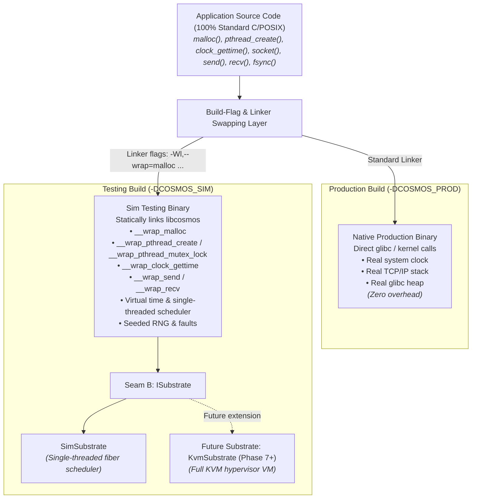

# Cosmos: Architecture - Build-Flag Swapping, Linker Interposition & Substrates

This document defines the structural architecture of Cosmos. It explains how Cosmos achieves **zero-code-change deterministic simulation testing** for standard POSIX C/C++ applications via **build-flag symbol interposition (`-Wl,--wrap`)** using **`libcosmos`** in testing builds, while compiling into a **zero-overhead native production binary** in production builds.

---

## Table of Contents

1. [Architectural Thesis](#1-architectural-thesis)
2. [The Layered Model](#2-the-layered-model)
3. [Build-Flag & Linker Interposition Layer](#3-build-flag--linker-interposition-layer)
4. [Inside `libcosmos` (The Determinism Engine)](#4-inside-libcosmos-the-determinism-engine)
5. [Substrate Seam B (`ISubstrate`)](#5-substrate-seam-b-isubstrate)
6. [Snapshot Interface & Multiverse Branching](#6-snapshot-interface--multiverse-branching)
7. [Determinism Comparison across Modes](#7-determinism-comparison-across-modes)
8. [Component Ownership Map](#8-component-ownership-map)

---

## 1. Architectural Thesis

Application code shouldn't need to be rewritten against custom framework runtime abstractions just to be deterministically testable. Standard C/POSIX library functions (`malloc`, `free`, `pthread_create`, `clock_gettime`, `socket`, `send`, `recv`, `read`, `write`, `getrandom`) form a clean, universal contract.

Cosmos achieves "one source, two binaries" by decoupling application code from execution mechanics using **Linker Symbol Interposition (`-Wl,--wrap`)**:
- **In Production**: The compiler/linker links standard system libraries (`libc`, OS sockets, OS time). Calls resolve directly to kernel/libc routines with **zero overhead**.
- **In Testing**: The linker wraps POSIX function symbols (`-Wl,--wrap=malloc -Wl,--wrap=pthread_create -Wl,--wrap=clock_gettime ...`) and binds them to **`libcosmos`**'s deterministic simulation framework (virtual time, tracked heap, single-threaded scheduler, simulated network, seeded PRNG).

---

## 2. The Layered Model



---

## 3. Build-Flag & Linker Interposition Layer

### Production Build (`-DCOSMOS_PROD`)
When building for production (e.g. `cmake -DCOSMOS_BUILD_MODE=PROD`), no special linker flags or Cosmos libraries are linked:
```bash
gcc -O3 -DCOSMOS_PROD main.c -o myapp
```
Calls to `malloc`, `pthread_create`, `clock_gettime`, `send`, `recv`, etc. resolve directly to standard system libraries. There are no wrapper objects, no virtual function dispatches, and zero runtime performance penalty.

### Testing Build (`-DCOSMOS_SIM`)
When building for deterministic testing (e.g. `cmake -DCOSMOS_BUILD_MODE=TEST`), the build system automatically injects symbol wrapping flags and links `libcosmos` statically:
```bash
gcc -g -DCOSMOS_SIM \
    -Wl,--wrap=malloc -Wl,--wrap=free \
    -Wl,--wrap=pthread_create -Wl,--wrap=pthread_join \
    -Wl,--wrap=pthread_mutex_lock -Wl,--wrap=pthread_mutex_unlock \
    -Wl,--wrap=clock_gettime -Wl,--wrap=nanosleep \
    -Wl,--wrap=socket -Wl,--wrap=send -Wl,--wrap=recv \
    -Wl,--wrap=write -Wl,--wrap=fsync \
    -Wl,--wrap=getrandom \
    main.c -lcosmos -o myapp_test
```
1. The linker transforms every call to `malloc(...)`, `pthread_create(...)`, etc., in application code and linked static libraries into `__wrap_malloc(...)`, `__wrap_pthread_create(...)`.
2. `libcosmos` implements `void* __wrap_malloc(size_t sz)`, `int __wrap_pthread_create(...)`, which route execution into Cosmos's single-threaded deterministic simulation engine.
3. If `libcosmos` needs the real system allocation function (e.g. for internal harness setup), it explicitly calls `__real_malloc(sz)`.

---

## 4. Inside `libcosmos` (The Determinism Engine)

`libcosmos` is a **static library embedded directly inside the testing binary (`myapp_test`)**. It is **not** an external background process or separate OS daemon.

When `myapp_test` executes:
1. `libcosmos` initializes the in-process **`cosmos::Universe` engine** in the testing binary's memory space.
2. The engine houses:
   - **Deterministic Scheduler**: Manages green thread / fiber execution queues (`ReadyQueue`, `WaitQueue`) and draws task choices from `schedule_rng`.
   - **Virtual Clock**: Advances linear nanosecond virtual time (`now_ns`) on quiescence.
   - **Simulated Subsystems**: Tracked heap allocator, virtual socket network topology, page cache storage model.
   - **Repro Engine**: Logs the master seed and computes an `FNV-1a` event trace hash for perfect replay verification.

```cpp
// Example wrapper implementation inside libcosmos (linked inside myapp_test)
extern "C" {

void* __wrap_malloc(size_t size) {
    auto& sim = cosmos::Universe::current();
    if (sim.faults().should_inject_oom(sim.fault_rng())) {
        errno = ENOMEM;
        return nullptr;
    }
    return sim.heap().allocate(size);
}

int __wrap_clock_gettime(clockid_t clk_id, struct timespec* tp) {
    auto& sim = cosmos::Universe::current();
    auto ns = sim.virtual_clock().now_ns();
    tp->tv_sec  = ns / 1'000'000'000ULL;
    tp->tv_nsec = ns % 1'000'000'000ULL;
    return 0;
}

ssize_t __wrap_send(int sockfd, const void* buf, size_t len, int flags) {
    auto& sim = cosmos::Universe::current();
    return sim.network().enqueue_send(sockfd, buf, len, flags);
}

}
```

The engine guarantees that for a given 64-bit seed, every `__wrap_*` call returns **bit-identical data at identical virtual timestamps**.

---

## 5. Substrate Seam B (`ISubstrate`)

Inside `libcosmos`, the determinism engine drives execution through `ISubstrate`:

```cpp
class ISubstrate {
public:
    virtual ~ISubstrate() = default;
    virtual NodeId create_node(std::string_view name) = 0;
    virtual void   crash(NodeId id) = 0;
    virtual void   reboot(NodeId id) = 0;
    virtual void   run_until(Time deadline_or_quiescence) = 0;
    virtual void   deliver_packet(NodeId target, Packet packet) = 0;
    virtual Snapshot save_snapshot() = 0;
    virtual void     restore_snapshot(Snapshot&& snap) = 0;
};
```

1. **`SimSubstrate` (Phases 1-6)**: Executes C++ fiber tasks inside the single-threaded simulation process. Determinism is maintained by single-threaded cooperation and wrapper interposition.
2. **`KvmSubstrate` (Phase 7+)**: Executes full virtual machine guests (Linux+KVM). Intercepts hypercalls and VM exits for unmodified multi-process guest OS determinism. Reuses 100% of the campaign runner, fault timeline, and exploration engine.

---

## 6. Snapshot Interface & Multiverse Branching

State-space exploration v3 forks a universe at critical decision points to explore alternative interleavings without restarting from time zero.

```cpp
struct Snapshot {
    uint64_t virtual_time_ns;
    uint64_t rng_state[4];
    std::vector<uint8_t> heap_state;
    std::vector<Packet> inflight_packets;
};
```

- **`SimSubstrate`**: Creates an in-process state copy of the tracked heap, virtual clock, and network queues.
- **`KvmSubstrate`**: Performs hypervisor COW memory snapshot & vCPU register state save.

---

## 7. Determinism Comparison across Modes

| Property | Native Prod (`-DCOSMOS_PROD`) | Sim Testing (`-DCOSMOS_SIM`) | Future KVM (`KvmSubstrate`) |
|---|---|---|---|
| **App Modification** | None (Standard POSIX) | None (Standard POSIX + `-Wl,--wrap`) | None (Unmodified ELF binary) |
| **Heap Allocator** | System `glibc` | Tracked Sim Heap (OOM faults + leak check) | Guest OS kernel heap |
| **Clock Source** | Kernel `CLOCK_MONOTONIC` | Virtual Deterministic Clock | Trapped Guest TSC / Branch Counter |
| **Network Stack** | Kernel TCP/IP Sockets | In-Process Simulated Topology | Virtual VNIC / TAP Bridge |
| **Concurrency** | Real OS Threads / epoll | Single-Threaded Fiber Scheduler | Single-Core Pinned VM Execution |
| **Execution Speed** | Native Hardware Speed | Extremely fast (~10,000s universes/sec) | VM Guest Speed |

---

## 8. Component Ownership Map

| Layer / Concept | Responsible Component | Target Binary |
|---|---|---|
| Standard POSIX function calls | Application Code | Both `myapp` & `myapp_test` |
| Linker Wrapping (`-Wl,--wrap`) | Build System (CMake/Makefile) | `myapp_test` only |
| `__wrap_*` Interposition Functions | `libcosmos` (Static Library) | `myapp_test` only |
| Virtual Clock, Tracked Heap, Network Graph | `cosmos::Universe` | `libcosmos` |
| Campaign Runner & Multi-Seed Exploration | `cosmos::Campaign` | `myapp_test` |
| Direct OS Passthrough (POSIX calls) | Standard `libc` / OS Kernel | `myapp` (production) |
