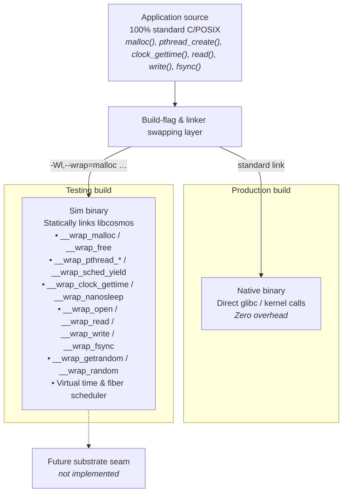
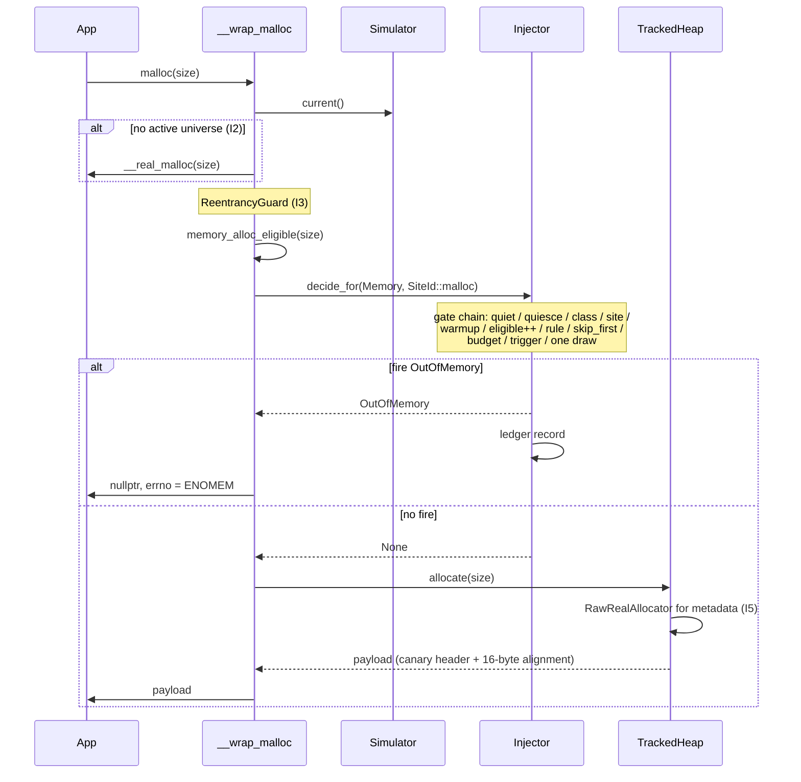
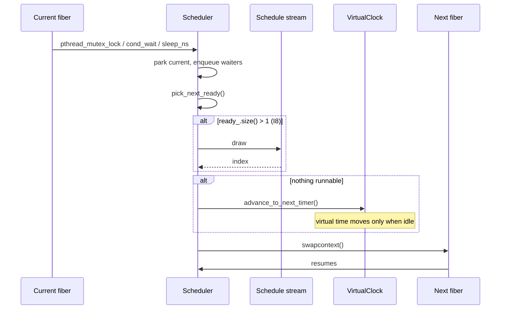
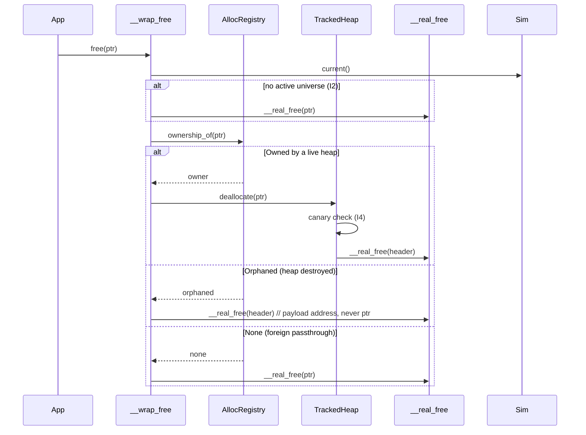
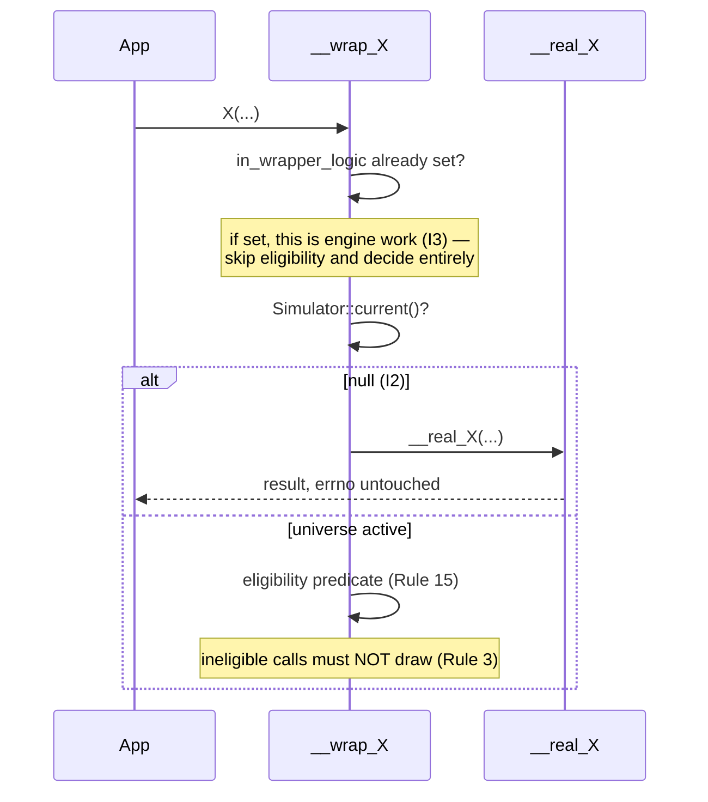

# Cosmos: Architecture

This document describes the structure of Cosmos **as it is built today**. It explains how Cosmos
achieves zero-code-change deterministic simulation testing for standard POSIX C/C++ applications
via build-flag symbol interposition (`-Wl,--wrap`), what the load-bearing invariants are, and
where the shipped code currently violates them.

Everything speculative lives in [`future-substrate.md`](future-substrate.md). Everything not yet
built is marked against the [`roadmap.md`](roadmap.md#unified-roadmap).

**Status legend.** `[shipped]` exists and is tested · `[partial]` exists with a stated gap ·
`[not-started]` no code · `[wont-do]` deliberately out of scope.

---

## Table of Contents

1. [Architectural Thesis](#1-architectural-thesis)
2. [The Layered Model](#2-the-layered-model)
3. [Build-Flag & Linker Interposition Layer](#3-build-flag--linker-interposition-layer)
4. [Inside `libcosmos`](#4-inside-libcosmos)
5. [Seams](#5-seams)
6. [Invariants](#6-invariants)
7. [Sequence Diagrams](#7-sequence-diagrams)
8. [Failure Semantics](#8-failure-semantics)
9. [Header Layers](#9-header-layers)
10. [Determinism Comparison Across Modes](#10-determinism-comparison-across-modes)
11. [Component Ownership Map](#11-component-ownership-map)

---

## 1. Architectural Thesis

Application code shouldn't need rewriting against framework runtime abstractions just to be
deterministically testable. Standard C/POSIX library functions (`malloc`, `free`, `pthread_create`,
`clock_gettime`, `socket`, `send`, `recv`, `read`, `write`, `getrandom`) form a clean, universal
contract.

Cosmos achieves "one source, two binaries" by decoupling application code from execution
mechanics using **linker symbol interposition (`-Wl,--wrap`)**:

- **Production** — the linker resolves POSIX symbols to `libc` and the kernel. No wrapper objects,
  no virtual dispatch, no runtime penalty.
- **Testing** — the linker rewrites those symbols to `__wrap_*` definitions in `libcosmos`, which
  route execution into a deterministic engine: virtual time, tracked heap, single-threaded fiber
  scheduler, seeded PRNG, and fault injection.

The whole design rests on one decision: **interposition is a link-time concern, not a
source-level one.** The application source is identical in both builds. That is what makes
[`docs/linker-interposition.md`](linker-interposition.md) — what `--wrap` can and cannot reach —
part of the architecture rather than an implementation note.

---

## 2. The Layered Model


```mermaid
graph TD
    App["Application source<br>100% standard C/POSIX<br><i>malloc(), pthread_create(), clock_gettime(), read(), write(), fsync()</i>"]

    App --> Layer["Build-flag &amp; linker swapping layer"]

    subgraph ProdPath ["Production build"]
        ProdBin["Native binary<br>Direct glibc / kernel calls<br><i>Zero overhead</i>"]
    end

    subgraph TestPath ["Testing build"]
        TestBin["Sim binary<br>Statically links libcosmos<br>• __wrap_malloc / __wrap_free<br>• __wrap_pthread_* / __wrap_sched_yield<br>• __wrap_clock_gettime / __wrap_nanosleep<br>• __wrap_open / __wrap_read / __wrap_write / __wrap_fsync<br>• __wrap_getrandom / __wrap_random<br>• Virtual time &amp; fiber scheduler"]
    end

    Layer -- "standard link" --> ProdBin
    Layer -- "-Wl,--wrap=malloc …" --> TestBin

    Future["Future substrate seam<br><i>not implemented</i>"]
    TestBin -.-> Future
```

**Not in the testing build today:** `__wrap_socket`, `__wrap_send`, and `__wrap_recv` are defined
but abort at runtime rather than simulating anything ([roadmap.md](roadmap.md#unified-roadmap),
network rows). See [`future-substrate.md`](future-substrate.md) for the substrate abstraction that
would replace the dotted edge.

---

## 3. Build-Flag & Linker Interposition Layer

### 3.1 Production build

```bash
gcc -O3 main.c -o myapp
```

POSIX calls resolve directly to system libraries. There is no wrapper object, no virtual dispatch,
and no runtime cost.

### 3.2 Testing build

The build system injects `--wrap` flags per target and links `libcosmos` statically. `examples/single_node/CMakeLists.txt` passes **34** wrap flags to `kv_store_sim`; the set below is abbreviated.

```bash
gcc -g \
    -fno-builtin-malloc -fno-builtin-free -fno-builtin-calloc -fno-builtin-realloc \
    -fno-builtin-random -fno-builtin-rand -fno-builtin-srand -fno-builtin-srandom \
    -ffunction-sections -fdata-sections \
    -Wl,--gc-sections \
    -Wl,--wrap=malloc -Wl,--wrap=free -Wl,--wrap=calloc -Wl,--wrap=realloc \
    -Wl,--wrap=pthread_create -Wl,--wrap=pthread_join -Wl,--wrap=pthread_mutex_lock \
    -Wl,--wrap=pthread_mutex_unlock -Wl,--wrap=pthread_cond_wait \
    -Wl,--wrap=pthread_cond_signal -Wl,--wrap=sched_yield \
    -Wl,--wrap=clock_gettime -Wl,--wrap=gettimeofday \
    -Wl,--wrap=nanosleep -Wl,--wrap=clock_nanosleep \
    -Wl,--wrap=open -Wl,--wrap=read -Wl,--wrap=write -Wl,--wrap=fsync \
    -Wl,--wrap=getrandom -Wl,--wrap=random -Wl,--wrap=rand -Wl,--wrap=srand -Wl,--wrap=srandom \
    main.c -lcosmos -o myapp_test
```

1. The linker rewrites each call to `malloc(...)`, `pthread_create(...)`, etc. into
   `__wrap_malloc(...)`, `__wrap_pthread_create(...)`.
2. `libcosmos` defines those `__wrap_*` functions and routes them into the engine.
3. When the engine needs the real function it calls `__real_malloc(sz)` explicitly.

### 3.3 The three flags that make subset wrapping work

This is the least obvious part of the build and it is load-bearing. `libcosmos` defines **more**
wrappers than any single target wraps; unused ones must be discarded, and the ones kept must not
be optimised away.

| Flag | Where | Why |
|---|---|---|
| `-ffunction-sections -fdata-sections` | `src/cosmos/CMakeLists.txt` | Each `__wrap_*` lands in its own section so the linker can drop the ones no target wraps |
| `-Wl,--gc-sections` | consumer link options | Performs that dropping. This is what makes "wrap only what you use" work |
| `-fno-builtin-{malloc,free,calloc,realloc,random,rand,srand,srandom}` | `src/cosmos/CMakeLists.txt`, propagated as an `INTERFACE` option | Without this the optimiser folds allocations and random calls back into intrinsics that never reach the wrapped symbol. Propagating it as `INTERFACE` means a consumer cannot silently lose interposition |

### 3.4 The build-mode defines are cosmetic

The example targets set these as compile definitions. **No source file references them.** They do
not switch behaviour; the per-target `--wrap` list does. Treat them as documentation of intent,
not as a mechanism.

### 3.5 What the wrapper mechanism cannot reach

The boundary of the interposition layer is architectural, not incidental. Full treatment is in
[`IMPLEMENTATION_NOTES.md`](IMPLEMENTATION_NOTES.md) and
[`determinism-contract.md`](determinism-contract.md); the short version:

| Gap | Consequence | Workaround in tree |
|---|---|---|
| Same translation unit | A call to `malloc` inside the same TU as its use can be resolved without the wrap | Wrappers live in their own TUs |
| glibc fortify substitution | `__read_chk` is substituted for `read` and would bypass the wrapper | `__wrap___read_chk` is defined in `wrap_storage.cpp` |
| `operator new` under shared `libstdc++` | Lives in `libstdc++.so`, whose internal `malloc` binding `--wrap` does not rewrite — so `std::` containers are not interposed | `tests/CMakeLists.txt` links the scenario suite a second time under `-static-libstdc++` to pin both sides |
| Raw syscalls | `syscall(SYS_...)` bypasses everything | Not mitigated. Stated as a user obligation |
| Unwrapped POSIX families | `epoll`, `poll`, `select`, `sendmsg`, `recvmsg`, `getaddrinfo`, `mmap`, `sigaction`, `timerfd_*`, `pread`, `dup`, `fcntl` and others are not wrapped at all | None. See [DEF-23](roadmap.md#known-defects) |

---

## 4. Inside `libcosmos`

`libcosmos` is a **static library embedded in the test binary**. It is not a daemon or an external
process.

### 4.1 What the engine is

The central type is `BasicSimulator<Injector>` (aliased to `Simulator`), not `Universe` — that
name survives only in comments and in `kDefaultUniverseSeed`. A simulator owns:

| Component | Type | Status |
|---|---|---|
| Tracked heap | `TrackedHeap` + process-wide `AllocRegistry` | `[shipped]` |
| Virtual clock | `VirtualClock` | `[shipped]` |
| Fiber scheduler | `Scheduler` (ucontext) | `[shipped]` |
| Seeded RNG | `Rng`, `StreamDomain`, seed derivation | `[shipped]` |
| Fault injector | `BasicFaultInjector<ClockLike>` | `[shipped]` |
| Fault ledger | fixed 256-entry buffer | `[shipped]`, truncating ([DEF-19](roadmap.md#known-defects)) |
| Simulated network | — | `[not-started]` ([DEF-23](roadmap.md#known-defects)) |
| Page-cache storage | — | `[not-started]` |
| Repro engine / FNV-1a trace hash | — | `[not-started]` |
| Campaign runner | — | `[not-started]` |

### 4.2 Scheduler

ucontext fibers (`getcontext` / `makecontext` / `swapcontext`), one OS thread per universe. The
loop pops a ready fiber, runs it until it parks, and advances virtual time to the earliest timer
only when nothing is runnable. Blocking outside a drain with no runnable work aborts
([DEF-5](roadmap.md#known-defects)).

### 4.3 A wrapper for real

The sample below is the shape actually used in `wrap_memory.cpp`. Compare it with the naive
passthrough that earlier revisions of this document showed: the reentrancy guard, the null-slot
check, and the eligibility predicate are not decoration — each one is an invariant from
[§6](#6-invariants).

```cpp
extern "C" void* __wrap_malloc(size_t size) {
    auto* sim = cosmos::Simulator::current();
    if (sim == nullptr) return __real_malloc(size);            // I2: no universe -> passthrough

    cosmos::wrappers::ReentrancyGuard guard;                    // I3: engine work is unfaulted
    if (!cosmos::wrappers::memory_alloc_eligible(size)) {      // Rule 15: legal outcome only
        return sim->heap().allocate(size);
    }
    if (cosmos::wrappers::decide_for(
            sim, cosmos::FaultClass::Memory, cosmos::SiteId::malloc) ==
        cosmos::FaultKind::OutOfMemory) {
        errno = ENOMEM;
        return nullptr;
    }
    return sim->heap().allocate(size);                         // I5: registry path via RawRealAllocator
}
```

The guarantee this is meant to provide — for a given seed, every `__wrap_*` call returns the same
data at the same virtual timestamp — holds **within one compiler and one build type**. It is not
bit-stable across compilers ([DEF-18](roadmap.md#known-defects)) and not stable across build types
([DEF-3](roadmap.md#known-defects)). The precise contract is
[`determinism-contract.md`](determinism-contract.md).

---

## 5. Seams

Four things are genuinely decoupled. Everything else is concrete.

| Seam | What crosses it | Where |
|---|---|---|
| `--wrap` adapters | POSIX calls into the engine | `src/cosmos/wrappers/`, one TU per family |
| `Injector` template parameter | Fault policy out of the simulator | `BasicSimulator<Injector>`; constrained by `HasFactory` (`simulator.hpp:22-23`) and `ClockLike` (`fault_injector.hpp:17-21`) |
| Fault data model | Configuration with no simulator reference | `FaultConfig`, `FaultRule`, `SiteId`, `FaultKind` in `faults.hpp` |
| `__real_*` escape | Engine's own allocations and sync to the host | `RawRealAllocator` (`memory.hpp:61-79`), `__real_*` calls |

**Explicit non-goal:** no virtual dispatch in wrapper paths. Wrapper calls are on the per-call hot
path and inside the reentrancy discipline of
[invariant I3](#6-invariants). See
[`future-substrate.md`](future-substrate.md) for what would have to change to justify one.

Note that `decide_for` is templated on the simulator type rather than taking a base pointer, and
`injector_or_null()` is a pointer API rather than a reference — both are deliberate: the template
keeps the wrapper free of a vtable, and the nullable pointer keeps the no-injector case from
allocating ([I5](#6-invariants)).

---

## 6. Invariants

Each invariant has a home in the code and a symptom if broken. **The Status column is honest**:
some of these are currently violated, and the violations are recorded rather than hidden.

| ID | Invariant | Home | Status | If broken |
|---|---|---|---|---|
| **I1** | **One universe per OS thread.** Three `thread_local` anchors hold this: `BasicSimulator::current_sim_`, `t_active_scheduler`, `wrappers::in_wrapper_logic`. A second OS thread gets an empty slot and falls through to the host | `simulator.hpp:105-109`, `task.cpp:35`, `wrapper_fault.hpp:15` | **violated** — [DEF-2](roadmap.md#known-defects) | Unsynchronised state in the engine |
| **I2** | **Off-thread calls are unfaulted passthrough.** A wrapped call with no active universe goes straight to `__real_*`. This is the documented escape hatch, not a bug | `simulator.hpp:46` `has_current()` | held | — |
| **I3** | **Engine work never faults itself.** `in_wrapper_logic` + `ReentrancyGuard` mark wrapper-internal calls; `RawRealAllocator` routes container allocations past the wrapper to `__real_malloc` | `wrapper_fault.hpp:15-27`, `memory.hpp:61-79` | **partial** — [DEF-14](roadmap.md#known-defects) | Infinite recursion in `__wrap_malloc`, or the engine consuming its own RNG draws |
| **I4** | **Registry ownership: downgrade, never erase.** A dying heap marks its blocks `Orphaned` rather than deleting the entry, so a later free can still tell a tracked pointer from a passthrough one | `memory.hpp:118-167`, `orphan_owned_by` at `memory.hpp:152` | **violated** — [DEF-1](roadmap.md#known-defects) | Interior pointer forwarded to `__real_free` → host heap corruption |
| **I5** | **No allocation in wrapper paths.** A wrapped call must not allocate, or it re-enters `__wrap_malloc` and clobbers `errno` | `wrapper_fault.hpp` comment on the eligibility predicates | held | — |
| **I6** | **Subset-link contract.** `-ffunction-sections` + `--gc-sections` + `-fno-builtin-*` together mean a target wraps only what it asks for and cannot have those calls folded away | `src/cosmos/CMakeLists.txt:17-39` | held | Wrapper silently dropped or optimised away |
| **I7** | **`operator new` reach is pinned by a second link.** Because the interposition of `operator new` depends on static `libstdc++`, the scenario suite is built twice so neither behaviour is assumed | `tests/CMakeLists.txt:258-294` | held | Eligible-call counts unverifiable |
| **I8** | **Draw only when the choice matters.** `pick_next_ready` consumes a schedule-stream draw only when `ready_.size() > 1`, so a single-fiber run consumes none | `task.hpp:142-144`, `task.cpp:102-112` | held | Schedule-stream drift against the documented draw count |
| **I9** | **Determinism is a build-type property.** Behaviour must not depend on `NDEBUG` | headers | **violated** — [DEF-3](roadmap.md#known-defects) | Debug and Release runs diverge |
| **I10** | **A rule that validates must be able to fire.** Silent no-op configuration is unacceptable in a chaos tool | `faults.hpp` `validate()` | **violated** — [DEF-8](roadmap.md#known-defects), [DEF-9](roadmap.md#known-defects) | User believes a fault class is active when it is not |

The concurrency story in one line: **the engine has no locks, by design.** The only synchronised
structure is `AllocRegistry` (`memory.hpp:118-166`), and it exists precisely to serve frees
arriving from any context — which is why [DEF-2](roadmap.md#known-defects) matters.

---

## 7. Sequence Diagrams

### 7.1 `malloc` → decision → ledger → heap


```mermaid
sequenceDiagram
    participant App
    participant W as __wrap_malloc
    participant Sim as Simulator
    participant Inj as Injector
    participant Heap as TrackedHeap

    App->>W: malloc(size)
    W->>Sim: current()
    alt no active universe (I2)
        W->>App: __real_malloc(size)
    end
    Note over W: ReentrancyGuard (I3)
    W->>W: memory_alloc_eligible(size)
    W->>Inj: decide_for(Memory, SiteId::malloc)
    Note over Inj: gate chain: quiet / quiesce / class / site /<br>warmup / eligible++ / rule / skip_first /<br>budget / trigger / one draw
    alt fire OutOfMemory
        Inj-->>W: OutOfMemory
        Inj->>Inj: ledger record
        W->>App: nullptr, errno = ENOMEM
    else no fire
        Inj-->>W: None
        W->>Heap: allocate(size)
        Heap->>Heap: RawRealAllocator for metadata (I5)
        Heap-->>W: payload (canary header + 16-byte alignment)
        W->>App: payload
    end
```

### 7.2 Fiber park → pick → switch → timer advance


```mermaid
sequenceDiagram
    participant Cur as Current fiber
    participant Sched as Scheduler
    participant Rng as Schedule stream
    participant Clock as VirtualClock
    participant Next as Next fiber

    Cur->>Sched: pthread_mutex_lock / cond_wait / sleep_ns
    Sched->>Sched: park current, enqueue waiters
    Sched->>Sched: pick_next_ready()
    alt ready_.size() > 1 (I8)
        Sched->>Rng: draw
        Rng-->>Sched: index
    end
    alt nothing runnable
        Sched->>Clock: advance_to_next_timer()
        Note over Clock: virtual time moves only when idle
    end
    Sched->>Next: swapcontext()
    Next->>Sched: resumes
```

### 7.3 `free` → registry → owner or orphan


```mermaid
sequenceDiagram
    participant App
    participant W as __wrap_free
    participant Reg as AllocRegistry
    participant Heap as TrackedHeap
    participant Host as __real_free

    App->>W: free(ptr)
    W->>Sim: current()
    alt no active universe (I2)
        W->>Host: __real_free(ptr)
    end
    W->>Reg: ownership_of(ptr)
    alt Owned by a live heap
        Reg-->>W: owner
        W->>Heap: deallocate(ptr)
        Heap->>Heap: canary check (I4)
        Heap->>Host: __real_free(header)
    else Orphaned (heap destroyed)
        Reg-->>W: orphaned
        W->>Host: __real_free(header)  // payload address, never ptr
    else None (foreign passthrough)
        Reg-->>W: none
        W->>Host: __real_free(ptr)
    end
```

### 7.4 The path a new wrapper is most likely to break


```mermaid
sequenceDiagram
    participant App
    participant W as __wrap_X
    participant Host as __real_X

    App->>W: X(...)
    W->>W: in_wrapper_logic already set?
    Note over W: if set, this is engine work (I3) —<br>skip eligibility and decide entirely
    W->>W: Simulator::current()?
    alt null (I2)
        W->>Host: __real_X(...)
        Host-->>App: result, errno untouched
    else universe active
        W->>W: eligibility predicate (Rule 15)
        Note over W: ineligible calls must NOT draw (Rule 3)
    end
```

This last diagram is the one to follow when adding a wrapper. Getting the two early exits in the
wrong order — drawing before checking `current()`, or deciding while `in_wrapper_logic` is set —
is the failure mode that silently corrupts every later seed.

---

## 8. Failure Semantics

What the engine does when things go wrong. Several of these are known gaps, recorded in
[`roadmap.md`](roadmap.md#known-defects).

| Condition | Current behaviour | Status |
|---|---|---|
| Deadlock outside the quiesce drain | `abort()` | [DEF-5](roadmap.md#known-defects) — kills the harness instead of reporting |
| Deadlock during quiesce drain | Recorded as a `cosmos.lifecycle` failure | correct |
| `pthread_exit` on the main fiber | `exit()` | [DEF-5](roadmap.md#known-defects) |
| Allocation canary corrupted | `deallocate()` returns `false`, block deliberately leaked, result discarded | [DEF-4](roadmap.md#known-defects) — never reported |
| Double free of a simulated pointer | Payload address forwarded to `__real_free` | [DEF-1](roadmap.md#known-defects) — host corruption |
| Fault config rejects | `validate()` returns the first `ConfigProblem` in documented order | correct |
| Fault config validates but cannot fire | Accepted silently | [DEF-9](roadmap.md#known-defects) |
| Ledger overflow | Oldest lost, `dropped_` incremented | [DEF-19](roadmap.md#known-defects) |
| Workload throws | Exception escapes `Scenario::run` without a lifecycle entry | [DEF-22](roadmap.md#known-defects) |

---

## 9. Header Layers

All public headers live in `include/cosmos/`.

### Core — the engine

`time.hpp` · `random.hpp` · `memory.hpp` · `task.hpp` · `faults.hpp` · `fault_injector.hpp` ·
`ledger.hpp` · `ledger_print.hpp`

### Adapters — POSIX interposition

`src/cosmos/wrappers/wrap_memory.cpp` · `wrap_time.cpp` · `wrap_random.cpp` · `wrap_storage.cpp` ·
`wrap_threads.cpp` · `wrap_net.cpp`

`wrapper_fault.hpp` is the shared policy header. **It lives in `src/cosmos/wrappers/`, not in
`include/`** — it is internal by placement, yet `test_wrap_malloc.cpp`, `test_wrap_random.cpp`,
`test_wrap_storage.cpp`, and `test_scheduler.cpp` include it directly as a white-box test. That
reach into `src/` is the current arrangement and is listed as a defect candidate alongside the
other header-layer gaps below.

### Harness — driving a run

`simulator.hpp` · `scenario.hpp`

### Umbrella and stubs

`cosmos.hpp` is **not** a complete umbrella: it includes four of the fourteen headers
(`faults.hpp`, `memory.hpp`, `simulator.hpp`, `time.hpp`) and ends in an empty
`namespace cosmos {}`. It is not a usable "include everything" surface today.

Four headers are three-line stubs containing only `namespace cosmos {}`:

| Header | Named in | Status |
|---|---|---|
| `net.hpp` | [`architecture.md`](architecture.md) network rows, [`design.md`](design.md) §6 | `[not-started]` |
| `gen.hpp` | [`design.md`](design.md) §11 | `[not-started]` |
| `assert.hpp` | [`design.md`](design.md) §12 | `[not-started]` |
| `campaign.hpp` | [`design.md`](design.md) §13 | `[not-started]` |

They remain in the tree because the documents reference them by name. They are marked here rather
than in the files, so that no source edit is required to record their status.

`virtual_clock.hpp` is a compatibility shim that re-exports `time.hpp`. Its stated rationale —
injector tests including it — is stale ([DEF-13](roadmap.md#known-defects)).

---

## 10. Determinism Comparison Across Modes

Status marks whether the column is a shipped capability or an intention.

| Property | Native prod | Sim testing `[shipped]` | Hypervisor substrate `[wont-do]` |
|---|---|---|---|
| App modification | none | none | none (unmodified ELF) |
| Heap allocator | system glibc | tracked sim heap, OOM faults | guest kernel heap |
| Clock source | kernel `CLOCK_MONOTONIC` | virtual deterministic clock | trapped guest TSC |
| Network stack | kernel TCP/IP | **not implemented** | virtual VNIC / TAP bridge |
| Storage | kernel filesystem | real kernel I/O + point faults | guest block device |
| Concurrency | real OS threads | single-threaded fiber scheduler | single-core pinned VM |
| Execution speed | native | not benchmarked | VM guest speed |

The "~10,000s universes/sec" figure this table previously carried was unmeasured; there is no
benchmark in the repository. The "zero overhead" claim for production is structurally true — no
wrapper objects exist in that build — but is likewise not measured.

---

## 11. Component Ownership Map

| Concern | Responsible component | Status |
|---|---|---|
| POSIX function calls | application code | both binaries |
| Linker wrapping (`-Wl,--wrap`) | build system (CMake / Justfile) | test binary only |
| `__wrap_*` interposition functions | `libcosmos` static library | test binary only |
| Virtual clock, tracked heap, scheduler | `BasicSimulator<Injector>` | `[shipped]` |
| Fault model, rules, legality | `faults.hpp` | `[shipped]` |
| Fault decisions, gates, streams | `BasicFaultInjector` | `[shipped]` |
| Decision ledger | `ledger.hpp` | `[shipped]` |
| Run lifecycle, checks, reports | `scenario.hpp` | `[shipped]` |
| Simulated network topology | — | `[not-started]` |
| Campaign runner & multi-seed exploration | — | `[not-started]` ([`campaign.hpp`](roadmap.md#unified-roadmap) is empty) |
| Direct OS passthrough | `libc` / kernel | production binary |
