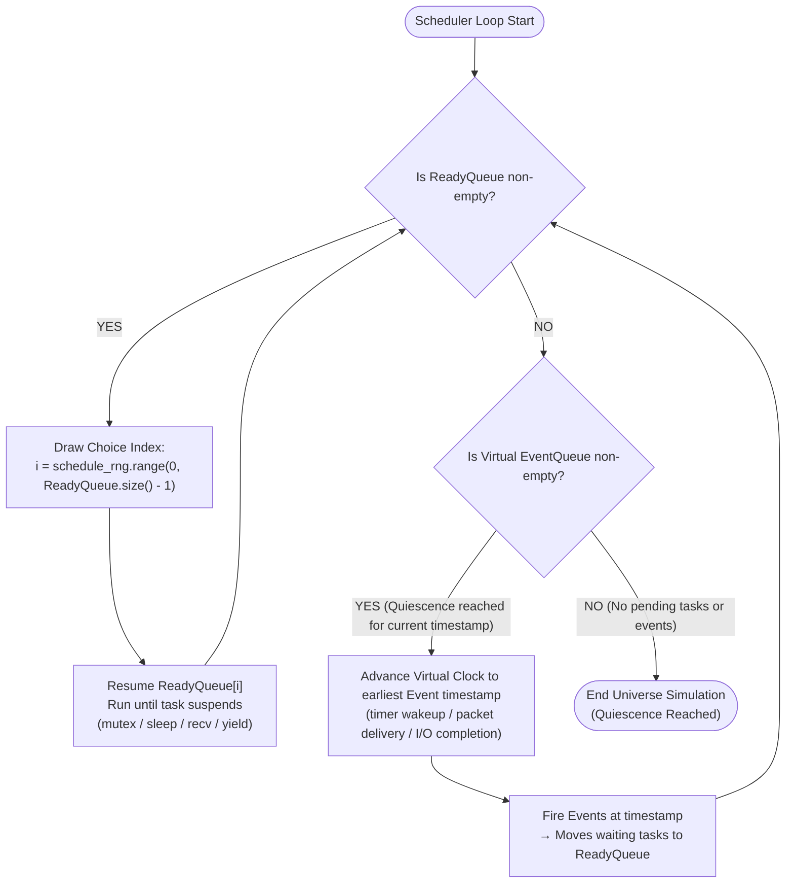

# Cosmos Library: Design & Public API Reference

This is the authoritative design document for `libcosmos`. It defines the standard POSIX function
wrapping taxonomy, public interfaces, and semantics that make simulation runs deterministic and
explorable.

**Every section carries a `Status:` line.** This document describes both what is built and what is
specified but not built; the status line is what distinguishes them. Do not implement against a
`[not-started]` section without first updating the [`roadmap.md`](roadmap.md#unified-roadmap) row.

| Status | Meaning |
|---|---|
| `[shipped]` | Exists and is tested |
| `[partial]` | Exists with a stated gap |
| `[not-started]` | Specified here, no code. Any header named is a stub |
| `[wont-do]` | Deliberately out of scope |

Structure and invariants live in [`architecture.md`](architecture.md). The determinism contract
lives in [`determinism-contract.md`](determinism-contract.md).

---

## Table of Contents

1. [Concepts](#1-concepts)
2. [Build-Flag Swapping & Linker Interposition](#2-build-flag-swapping--linker-interposition)
3. [POSIX Standard Function Taxonomy](#3-posix-standard-function-taxonomy)
4. [Memory Subsystem Reference](#4-memory-subsystem-reference)
5. [Time Subsystem Reference](#5-time-subsystem-reference)
6. [Network Subsystem Reference](#6-network-subsystem-reference)
7. [Randomness Subsystem Reference](#7-randomness-subsystem-reference)
8. [Storage Subsystem Reference](#8-storage-subsystem-reference)
9. [Fault Injection Framework](#9-fault-injection-framework)
10. [Task & Concurrency API & Deterministic Scheduling](#10-task--concurrency-api--deterministic-scheduling)
11. [Data Generators (`gen.hpp`)](#11-data-generators-genhpp)
12. [Assertions (`assert.hpp`)](#12-assertions-asserthpp)
13. [Campaign Engine (`campaign.hpp`)](#13-campaign-engine-campaignhpp)
14. [The Determinism Contract](#14-the-determinism-contract)
15. [Error Handling & Tracing](#15-error-handling--tracing)
16. [Non-Goals](#16-non-goals)

---

## 1. Concepts

**Status: `[shipped]` for the first six rows. `Node`, `Finding`, and `Campaign` describe a
capability that does not exist yet — see the [roadmap](roadmap.md#unified-roadmap).**

| Term | Meaning | Status |
|---|---|---|
| **Universe** | One simulator instance running one seeded execution. The type is `BasicSimulator<Injector>`, aliased `Simulator` — `Universe` is a concept name, not a class | `[shipped]` |
| **Seed** | 64-bit seed value; fully determines a universe (same binary + seed ⇒ identical execution), within the qualifiers in [`determinism-contract.md`](determinism-contract.md) | `[shipped]` |
| **Linker Wrapping** | GCC/Clang `-Wl,--wrap=symbol` mechanism that intercepts standard C/POSIX function calls and routes them to `libcosmos`. See [`IMPLEMENTATION_NOTES.md`](IMPLEMENTATION_NOTES.md) | `[shipped]` |
| **RNG Stream** | Independent deterministic PRNG stream derived from the master seed by domain: `schedule`, `fault`, `workload`, `user`, `swarm`. The `swarm` domain is derived and never consumed | `[shipped]`, `swarm` unused |
| **Task** | A user-space green thread / fiber task cooperatively scheduled by the universe | `[shipped]` |
| **Virtual Time** | `Time` (int64 nanoseconds since universe start). Advances only when no task is runnable, to the next event | `[shipped]` |
| **Node** | A simulated virtual machine/container: an ownership group for endpoints, memory, and tasks. Passed to `install_faults` as a count and validated; nothing groups anything by it | `[not-started]` |
| **Finding** | A violated `always` assertion (or crash) in some universe, or a `sometimes` assertion hit in **no** universe of a campaign. `always`/`sometimes` do not exist | `[not-started]` |
| **Campaign** | N universes over N seeds, run in parallel across CPU cores, aggregating findings and printing repro seeds | `[not-started]` |

---

## 2. Build-Flag Swapping & Linker Interposition

**Status: `[shipped]`.** This section describes the mechanism as built.

Cosmos applications are written using **100% standard POSIX C/C++ function calls**. Swapping
between production and testing builds occurs at link time. **The layered diagram lives in
[`architecture.md`](architecture.md#2-the-layered-model)** — it is the single owner, and this
section does not redraw it.

| Mode | Linker flags | Interposition target | Runtime backend |
|---|---|---|---|
| Production | none | direct system calls | real OS (`libc`, kernel) |
| Testing | per-target `-Wl,--wrap=…` list — **34 flags** on `kv_store_sim` | `__wrap_*` functions | `libcosmos` (static library) |

**The `-DCOSMOS_PROD` / `-DCOSMOS_SIM` defines are cosmetic.** The example targets set them as
compile definitions, but no source file reads them. The real switch is the presence or absence of
the `--wrap` list on the target. Do not write `#ifdef COSMOS_SIM` and expect it to do anything.

Three flags are load-bearing beyond the wrap list — `-fno-builtin-*`,
`-ffunction-sections`/`-fdata-sections`, and `-Wl,--gc-sections` — because together they are what
makes "wrap only what you use" work. They are specified in
[`determinism-contract.md`](determinism-contract.md) §4 and explained in
[`IMPLEMENTATION_NOTES.md`](IMPLEMENTATION_NOTES.md) §4.

---

## 3. POSIX Standard Function Taxonomy

**Status: `[partial]`.** Memory, time, random, storage, and threads are wrapped. The network rows
below are specified but their wrappers **abort at runtime** — see
[DEF-9](roadmap.md#known-defects). The `Sim Mode Behavior` column describes what the wrapper does
today; where it describes an intention, the row says so.

| Category | Standard POSIX Function | Wrapped Symbol | Status | Sim Mode Behavior |
|---|---|---|---|---|
| **Memory** | `malloc(size)` | `__wrap_malloc` | `[shipped]` | Allocates from tracked sim heap; checks OOM fault injection |
| | `free(ptr)` | `__wrap_free` | `[shipped]` | Deallocates from tracked sim heap. Double-free detection is **broken** — see [DEF-1](roadmap.md#known-defects) |
| | `calloc(nmemb, size)` | `__wrap_calloc` | `[shipped]` | Zero-initialized sim heap allocation |
| | `realloc(ptr, size)` | `__wrap_realloc` | `[shipped]` | Resizes tracked sim heap allocation |
| **Time** | `clock_gettime(clk_id, tp)`| `__wrap_clock_gettime` | `[shipped]` | Writes current virtual simulation time into `timespec`. **Never consults the fault injector** — see [DEF-8](roadmap.md#known-defects) |
| | `gettimeofday(tv, tz)` | `__wrap_gettimeofday` | `[shipped]` | Writes current virtual simulation time into `timeval` |
| | `nanosleep(req, rem)` | `__wrap_nanosleep` | `[shipped]` | Suspends caller until virtual time reaches `now + req`. Same injector gap as above |
| | `clock_nanosleep(clk, flags, req, rem)` | `__wrap_clock_nanosleep` | `[shipped]` | Suspends caller until `now + req`, or until `req` as an absolute deadline under `TIMER_ABSTIME` |
| **Network**| `socket(domain, type, p)` | `__wrap_socket` | `[not-started]` | **`abort()`.** Specified as: returns virtual socket descriptor bound to active Node |
| | `bind(fd, addr, len)` | `__wrap_bind` | `[not-started]` | **`abort()`.** Specified as: binds virtual socket descriptor to virtual port |
| | `listen(fd, backlog)` | `__wrap_listen` | `[not-started]` | **`abort()`.** Specified as: marks virtual socket descriptor as passive listener |
| | `accept(fd, addr, len)` | `__wrap_accept` | `[not-started]` | **`abort()`.** Specified as: blocks until incoming connection event arrives |
| | `connect(fd, addr, len)` | `__wrap_connect` | `[not-started]` | **`abort()`.** Specified as: initiates virtual connection event across sim network graph |
| | `send(fd, buf, len, flags)`| `__wrap_send` | `[not-started]` | **`abort()`.** Specified as: injects packet into sim network with latency/loss/reorder faults |
| | `recv(fd, buf, len, flags)`| `__wrap_recv` | `[not-started]` | **`abort()`.** Specified as: suspends caller until virtual packet delivery event arrives |
| | `close(fd)` | `__wrap_close` | `[shipped]` | Unconditional passthrough to `__real_close`. Specified as: closes virtual socket descriptor / frees endpoint |
| **Storage**| `open(path, flags, mode)` | `__wrap_open` | `[partial]` | Real kernel open plus point faults (`OpenEio`, `NoSpace`). Specified as: opens virtual file descriptor in sim disk subsystem |
| | `read(fd, buf, count)` | `__wrap_read`, `__wrap___read_chk` | `[partial]` | Real kernel read plus `ReadEio`. Specified as: reads from virtual page cache / disk image |
| | `write(fd, buf, count)` | `__wrap_write` | `[partial]` | Real kernel write plus `EIO`/`ENOSPC`/honest `ShortWrite`. Specified as: appends dirty bytes to un-synced virtual page cache |
| | `fsync(fd)` | `__wrap_fsync` | `[partial]` | Real `fsync` plus point faults. Specified as: flushes un-synced page cache to durable virtual storage |
| **Random** | `getrandom(buf, len, fl)` | `__wrap_getrandom` | `[shipped]` | Fills buffer with bytes from seeded `xoshiro256**` stream; mirrors kernel argument-validation order |
| | `random()` | `__wrap_random` | `[shipped]` | Returns a draw from the seeded `User` RNG stream |
| | `rand()` | `__wrap_rand` | `[shipped]` | Returns a draw from the seeded `User` RNG stream (shared with `random()`) |
| | `srandom(seed)`, `srand(seed)` | `__wrap_srandom`, `__wrap_srand` | `[shipped]` | Deterministic no-ops; host seeding never perturbs the `User` stream |
| **Threads / Sync** | `pthread_create(thread, attr, fn, arg)` | `__wrap_pthread_create` | `[shipped]` | Spawns green thread / fiber task in sim scheduler (no OS thread). `attr` is ignored — see [DEF-16](roadmap.md#known-defects) |
| | `pthread_join(thread, retval)` | `__wrap_pthread_join` | `[shipped]` | Suspends current task until target green thread completes. Double-join misbehaves — see [DEF-7](roadmap.md#known-defects) |
| | `pthread_mutex_lock(mutex)` | `__wrap_pthread_mutex_lock` | `[shipped]` | Locks sim mutex; suspends task on mutex wait queue if contested |
| | `pthread_mutex_unlock(mutex)` | `__wrap_pthread_mutex_unlock` | `[shipped]` | Unlocks sim mutex; unblocks waiting tasks to Ready Queue |
| | `pthread_cond_wait(cond, mutex)` | `__wrap_pthread_cond_wait` | `[shipped]` | Unlocks mutex, suspends task on condvar queue, yields to scheduler |
| | `pthread_cond_signal(cond)` | `__wrap_pthread_cond_signal` | `[shipped]` | Unblocks task waiting on condvar back to Ready Queue |
| | `sched_yield()` | `__wrap_sched_yield` | `[shipped]` | Yields current task to sim scheduler choice draw |

Also wrapped but not listed above: `pthread_detach`, `pthread_self`, `pthread_equal`,
`pthread_exit`, `pthread_mutex_init`/`destroy`/`trylock`, `pthread_cond_init`/`destroy`/
`broadcast`.

**Not wrapped at all** — `epoll`/`poll`/`select`, `sendmsg`/`recvmsg`, `getaddrinfo`, `mmap`,
`sigaction`, `timerfd_*`, `pread`, `pwrite`, `fdatasync`, `rename`, `unlink`, `dup`, `fcntl`,
rwlocks, barriers, semaphores. These reach the host with no diagnostic
([DEF-23](roadmap.md#known-defects)). `EINTR`, short reads, and fd exhaustion are not modelled
([DEF-24](roadmap.md#known-defects)).

---

## 4. Memory Subsystem Reference

**Status: `[shipped]`**, with one broken guarantee noted below.

In testing builds, `__wrap_malloc` and `__wrap_free` intercept heap operations:

- **OOM Fault Injection**: `__wrap_malloc`, `__wrap_calloc` and `__wrap_realloc` each ask the fault injector for one decision per eligible call (`FaultClass::Memory`, `SiteId::malloc` / `calloc` / `realloc`) and translate `OutOfMemory` to `nullptr` plus `errno = ENOMEM`. The decision happens before the heap is touched, so a fired OOM leaves `TrackedHeap` untouched and a failed `realloc` leaves the original block valid. Rates, budgets, windows and occurrence triggers come from the `FaultConfig` installed with `Simulator::install_faults` (`fault-injection.md` §12). Eligibility: a `calloc` size-product overflow is a real API failure answered before the injector, `realloc(ptr, 0)` is a free, and a block this universe does not own is never faulted — none of the three consumes a draw. `malloc(0)` *is* eligible, since returning `nullptr` there is a legal C11 result.
- **Leak Detection**: **opt-in**, via `Scenario::check_no_leaks`. It is deliberately not automatic at universe end: a workload that legitimately holds state past quiesce would false-positive on a blanket check. There is no allocation backtrace capture. An earlier revision of this document promised an automatic check with backtraces and repro seeds; that was never built, and the code's opt-in design is the correct one. See [`testing.md`](testing.md) §3.
- **Double-Free Detection**: the comment this section previously carried claimed it. It is **broken** — a second free of a simulated pointer forwards a payload address to `__real_free`, corrupting the host allocator. See [DEF-1](roadmap.md#known-defects). Corruption of an allocation canary is likewise detected and then silently discarded ([DEF-4](roadmap.md#known-defects)).

---

## 5. Time Subsystem Reference

**Status: `[shipped]`**, with an API ambiguity noted below.

In testing builds, virtual time advances deterministically:

- **Virtual Clock Advancement**: Virtual time does **not** advance during CPU computation. It advances instantaneously to the next scheduled event timestamp when all tasks suspend.
- **Two sleep APIs.** The wrapped `nanosleep` / `clock_nanosleep` route to the scheduler and suspend the caller. `VirtualClock::nanosleep` / `clock_nanosleep` are *also* public and advance the clock in place without suspending — a legacy of the pre-scheduler design. Calling the latter directly silently violates the scheduler's timer model. See [DEF-11](roadmap.md#known-defects).
- **Clock faults are unreachable.** `ClockStep` and `SleepInterrupted` are defined and validate cleanly, but the clock wrappers never consult the injector. See [DEF-8](roadmap.md#known-defects).

---

## 6. Network Subsystem Reference

**Status: `[not-started]`.** `net.hpp` is an empty stub and all seven socket wrappers **abort** at
runtime under an active universe. Nothing below is implemented. This is the specification for the
network that [the roadmap](roadmap.md#unified-roadmap) would build.

```cpp
struct Address {
    uint32_t node_id;
    uint16_t port;
};

class Net {
public:
    void partition(std::vector<uint32_t> group_a, std::vector<uint32_t> group_b);
    void heal_all();

    using Verdict = std::variant<Drop, DeliverAfter>;
    std::function<Verdict(const PacketView&)> on_send;
};
```

### Delivery Semantics (specified, not implemented):
1. `send()` consults partition maps → `on_send` hook → `Network`-class latency/loss draws.
2. Surviving packets become delivery events scheduled at `virtual_now + sampled_latency`.
3. Node crash closes endpoints and cancels pending `recv()` calls.

Until this exists, `FaultClass::Network` and its seven `FaultKind` values are validated by
`FaultConfig::validate()` and then can never fire — see [DEF-9](roadmap.md#known-defects).

---

## 7. Randomness Subsystem Reference

**Status: `[shipped]`.**

```cpp
class Rng {
public:
    explicit Rng(uint64_t seed);

    uint64_t next();
    uint64_t range(uint64_t lo, uint64_t hi);
    bool     coin(double p);
    double   uniform();
};
```

There is no `Rng::derive` member. Derivation is a set of free functions in `random.hpp`:

```cpp
uint64_t derive_seed(uint64_t parent, uint64_t index);
uint64_t universe_seed(uint64_t campaign_seed, uint64_t index);
uint64_t stream_seed(uint64_t universe_seed, StreamDomain domain);
```

RNG stream domains (`StreamDomain`): `Schedule=1`, `Fault=2`, `Workload=3`, `User=4`, `Swarm=5`.
Splitmix64 stream derivation ensures independent exploration dimensions across seeds. `Swarm` is
derived and never consumed — it belongs to the swarm sampler, which is
[not-started](roadmap.md#unified-roadmap).

---

## 8. Storage Subsystem Reference

**Status: `[partial]`.** Point faults are shipped. The page-cache durability model is not.

### Shipped today

`__wrap_open/read/write/fsync` ask the fault injector for one
decision per eligible call and translate it to a legal result — `EIO`/`ENOSPC` failures, or a
`ShortWrite` that performs a *real* partial transfer of `count / 2` bytes (write() reporting k
bytes must mean k bytes were transferred; claiming a short count without transferring would be
an impossible world). Decisions happen before the real call, so a faulted call has no side
effects. Eligibility: standard stream fds (0/1/2) and zero-length transfers never reach the
injector — logging must not consume Storage-stream draws, and no outcome is observable on an
empty transfer — so `fire_on_eligible_call` on `SiteId::write` counts only writes of
`count >= 1` to fds `>= 3`. 1-byte writes stay eligible: they can legally fail with
`EIO`/`ENOSPC` (a single-byte WAL commit marker is a real shape); the one degenerate case is a
fired `ShortWrite` on a 1-byte write, which has no legal short observable and observably
degrades to a complete write.

All I/O in this mode is **real kernel I/O**. A faulted write leaves the file untouched — there is
no simulated disk.

### Not implemented: the page-cache / durability model

The following is the specification for a model that does not exist. It requires `sim.crash(node)`
and `sim.reboot(node)`, which belong to the unimplemented network and episode machinery.

- `write()` buffers dirty bytes in simulated un-synced page cache.
- `fsync()` commits buffered pages to durable storage.
- On `sim.crash(node)` followed by `sim.reboot(node)`: un-synced pages are discarded, and the last synced region may experience torn writes drawn from the `Storage` class.

Also not modelled: `EINTR`, short **reads**, and fd exhaustion (`EMFILE`/`ENFILE`). `read` can
only fire `ReadEio`. See [DEF-24](roadmap.md#known-defects).

---

## 9. Fault Injection Framework

**Status: `[shipped]` for the declarative config; `[not-started]` for mechanisms 2-4.**

Configuration is `FaultConfig` (`fault-injection.md` §12): per-class enable bits, per-site
activation, and a per-site `FaultRule` carrying rate, `skip_first`, `max_injections`, a weighted
outcome table and an optional occurrence trigger. It is installed once per universe with
`Simulator::install_faults(cfg, node_count)`, which derives the injector's seed from the `Fault`
stream domain (Rule 1) and binds it to that universe's clock.

```cpp
FaultConfig cfg;
cfg.enable_class(FaultClass::Memory);
cfg.activate_site(SiteId::malloc);

FaultRule oom;
oom.rate = 0.001;
oom.outcomes.add(FaultKind::OutOfMemory, 1.0);
cfg.set_rule(SiteId::malloc, oom);

sim.install_faults(std::move(cfg));
```

Four composable fault mechanisms. Only the first is built:

1. **Declarative Config** `[shipped]` — rates applied automatically via the `fault` RNG stream.
2. **Imperative Scripting** `[not-started]` — `sim.net().partition(...)`, `sim.crash(node)`, `sim.reboot(node)`. None of these methods exist on `Simulator`.
3. **Scheduled Faults** `[not-started]` — `sim.at(10s, [&]{ sim.net().partition(a, b); })`. `sim.at` does not exist. `FaultConfig::scheduled_episodes` is validated data that nothing executes.
4. **Custom Verdict Hooks** `[not-started]` — programmatic control via `sim.net().on_send`. `net.hpp` is empty.

`Knob` / `KnobId` are likewise validated and never consumed. See
[DEF-9](roadmap.md#known-defects) for the consequence: `validate()` accepts all of this
configuration and it then silently never fires.

---

## 10. Task & Concurrency API & Deterministic Scheduling

Cosmos supports standard POSIX `pthread` concurrency in application code with zero code modification (`pthread_create`, `pthread_join`, `pthread_mutex_*`, `pthread_cond_*`).

### How `pthread` Interposition Works (`-Wl,--wrap=pthread_create`)

In testing builds (`-DCOSMOS_SIM`), **no OS threads are created**. The entire simulation universe executes inside a single physical OS thread. Standard `pthread` calls are mapped to user-space green threads / fibers managed by Cosmos's single-threaded scheduler:

- **`__wrap_pthread_create(thread, attr, start_routine, arg)`**: Allocates a user-space task frame (green thread), pushes it to the scheduler's `ReadyQueue`, and assigns a virtual thread ID.
- **`__wrap_pthread_mutex_lock(mutex)`**: If the virtual mutex is free, acquires it immediately. If locked, moves the current task from `ReadyQueue` to the mutex's `WaitQueue` and yields execution to the scheduler.
- **`__wrap_pthread_mutex_unlock(mutex)`**: Releases the virtual mutex, moves waiting tasks from `WaitQueue` back to `ReadyQueue`, and yields to the scheduler choice point.
- **`__wrap_pthread_cond_wait(cond, mutex)`**: Atomically releases the mutex, moves the current task to the condition variable's `WaitQueue`, and yields control to the scheduler.
- **`__wrap_pthread_cond_signal(cond)`**: Unblocks one or all tasks from the condition variable queue, returning them to the `ReadyQueue`.

### Deterministic Scheduler Loop Algorithm

**Status: `[shipped]`, with one deviation from the diagram below.** Every context switch
decision *at a genuine choice point* is driven by the seeded `schedule` RNG stream. The real
implementation draws **only when more than one task is ready** (`pick_next_ready` checks
`ready_.size() > 1`), so a single-fiber run consumes no schedule draws at all. The diagram shows a
draw on every iteration for clarity; that is not what the code does. See
[I8](architecture.md#6-invariants).



### Why Determinism Holds under `pthread` Wrapping:
1. **Single-Threaded Execution**: Eliminates OS kernel thread preemption, CPU core cache line races, and hardware interrupt timing jitter.
2. **Seeded Choice Draws**: When multiple tasks are runnable, `schedule_rng` chooses which task runs next. A specific seed reproduces the **exact same sequence of thread interleavings**.
3. **Exploration**: Different seeds explore different valid interleavings, exposing race conditions, deadlocks, and missed condition signals.

---

## 11. Data Generators (`gen.hpp`)

**Status: `[not-started]`. `gen.hpp` is an empty stub. Nothing below exists.**

Property-testing-style generators drawing from the `workload` RNG stream:

```cpp
namespace cosmos::gen {
    uint64_t range(Rng&, uint64_t lo, uint64_t hi);
    bool     coin(Rng&, double p);
    template<typename T> T one_of(Rng&, std::initializer_list<T>);
    std::string string(Rng&, size_t len);
    Duration exponential(Rng&, Duration mean);
}
```

---

## 12. Assertions (`assert.hpp`)

**Status: `[not-started]`. `assert.hpp` is an empty stub.** The nearest shipped substitute is
`Scenario::check` / `Scenario::note_covered`, which provide per-run checks and coverage marking
but not the `always` / `sometimes` semantics below.

```cpp
namespace cosmos {
    void always(bool cond, std::string id, std::string detail = "");
    void sometimes(bool cond, std::string id);
    inline void reachable(std::string id) { sometimes(true, id); }
}

#define COSMOS_CHECK(cond, id) ::cosmos::always((cond), (id), \
        std::string(__FILE__) + ":" + std::to_string(__LINE__))
```

- `always`: Invariant property evaluated per universe. Violation = immediate finding.
- `sometimes`: Liveness/coverage property evaluated across all universes in a campaign. Must be hit at least once.

---

## 13. Campaign Engine (`campaign.hpp`)

**Status: `[not-started]`. `campaign.hpp` is an empty stub. Nothing below exists.**

```cpp
struct CampaignConfig {
    uint64_t trials    = 1000;
    uint64_t base_seed = 0;
    unsigned parallel  = std::thread::hardware_concurrency();
    bool     verify    = false;   // double-run verification mode
};

struct CampaignReport {
    uint64_t runs, failed_runs;
    std::vector<Failure> findings;
    std::vector<std::string> never_hit;
};

class Campaign {
public:
    static CampaignReport run(CampaignConfig, std::function<void(Simulator&, uint64_t)> build_fn);
};
```

---

## 14. The Determinism Contract

**Status: normative.** The full contract, including its qualifiers, build rules, and boundaries,
is [`determinism-contract.md`](determinism-contract.md). This section is the user-obligation
summary.

Under `libcosmos`, determinism holds provided that application code:
1. Accesses time only via POSIX time functions (`clock_gettime`, `gettimeofday`) or `sim.now()`.
2. Draws randomness only via POSIX random functions (`getrandom`, `random`, `rand`) or `sim.user_rng()`. There is no `sim.rng()`.
3. Performs I/O only via POSIX socket/file calls.
4. Avoids iteration dependencies on raw pointer addresses (ASLR leaks).
5. Issues no raw syscalls (`syscall(SYS_...)`).

Determinism holds **within one compiler, one optimisation level, and one build type**. See
[`determinism-contract.md`](determinism-contract.md) §1 for why each qualifier is load-bearing.

---

## 15. Error Handling & Tracing

**Status: `[not-started]`.** Neither item below exists. There is no CLI binary, no `trace_hash`,
and no `--verify` mode.

- Findings output a clear repro command: `myapp_test --seed 12345`.
- Tracing sink records FNV-1a event hash (`trace_hash`) used by `--verify` double-run validation.

What exists today is `ScenarioReport` with a printed `seed = …` line and, on failure, a rendered
`ledger_dump`. See [`testing.md`](testing.md) §3.

---

## 16. Non-Goals

- Multi-process universes inside a single simulation trial. This was deferred to
  [Phase 7](roadmap.md#unified-roadmap), which is now `wont-do` — see
  [`future-substrate.md`](future-substrate.md).
- Real OS thread preemption inside a simulation universe (simulations run single-threaded and cooperative for perfect reproducibility).
- Automatic insertion of faults into application logic. See
  [`fault-injection.md`](fault-injection.md) §8.3.
