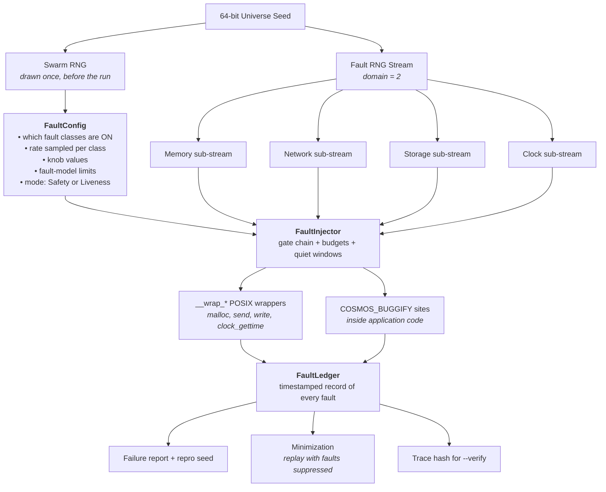
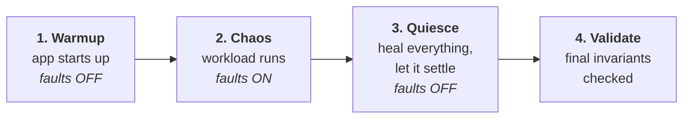
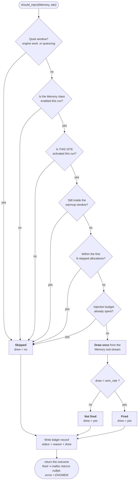

# Cosmos: Fault Injection Design

This document defines how `libcosmos` breaks things on purpose.

Fault injection is the part of the simulator that makes rare, unlucky situations happen often: memory running out, packets vanishing, disks corrupting, servers dying at the worst possible moment. Its job is **not** to decide whether the application is correct — that is the assertion layer's job (`always` / `sometimes`, see `docs/design.md` §12). Its job is to steer execution into the error paths that normal testing never reaches.

> **Core rule:** a fault is an **input**, not a failure. `malloc` returning `nullptr` is not a bug — it is a normal thing that happens on real machines. The bug is whatever the application does next.

Research background: **`docs/antithesis-study-notes.md`**. Full API reference: **`docs/design.md`**. Architecture & seams: **`docs/architecture.md`**.

---

## Table of Contents

1. [Concepts](#1-concepts)
2. [The Fault Model (What the System Promises to Survive)](#2-the-fault-model-what-the-system-promises-to-survive)
3. [Safety Mode vs Liveness Mode](#3-safety-mode-vs-liveness-mode)
4. [The Three Shapes of a Fault](#4-the-three-shapes-of-a-fault)
5. [Block-Level Architecture](#5-block-level-architecture)
6. [Two-Level Probability & Swarm Configuration](#6-two-level-probability--swarm-configuration)
7. [RNG Stream Discipline](#7-rng-stream-discipline)
8. [Injection Sites: Wrappers vs `COSMOS_BUGGIFY`](#8-injection-sites-wrappers-vs-cosmos_buggify)
9. [Run Lifecycle & Quiet Windows](#9-run-lifecycle--quiet-windows)
10. [The Decision Gate Chain](#10-the-decision-gate-chain)
11. [The Fault Ledger & Minimization](#11-the-fault-ledger--minimization)
12. [Public API Reference](#12-public-api-reference)
13. [Determinism Rules (Summary)](#13-determinism-rules-summary)
14. [Testing the Injector Itself](#14-testing-the-injector-itself)
15. [Implementation Roadmap](#15-implementation-roadmap)
16. [References](#16-references)

---

## 1. Concepts

| Term | Meaning |
|---|---|
| **Fault** | A bad-but-legal thing the simulator makes happen (memory failure, dropped packet, crashed node). |
| **Fault Model** | The written promise of which failures the application claims to survive. Faults outside it produce false bug reports. |
| **Fault Class** | A family of faults owned by one subsystem: `Memory`, `Network`, `Storage`, `Clock`, `Process`. |
| **Point Fault** | An instant, one-off fault (`malloc` fails). Decided by one dice roll at the call. |
| **Episode Fault** | A fault with a duration that must later heal (a network partition from t=30ms to t=45ms). |
| **Knob Fault** | Nothing breaks; a normal tuning value is set to an extreme-but-legal value (a 60s timeout becomes 0.1s). |
| **Swarm** | Choosing a *different* subset of fault classes and intensities for every universe, instead of one uniform setting for all. |
| **Injection Site** | A specific place a fault can be decided: a `__wrap_*` function, or a `COSMOS_BUGGIFY` marker in application code. |
| **Fault Ledger** | The timestamped record of every fault that fired in a universe. Used for reports, replay, and minimization. |
| **Quiet Window** | A span of the run during which no faults may fire (engine setup, app warmup, final settle-down). |

---

## 2. The Fault Model (What the System Promises to Survive)

Every system under test carries a promise. For example:

> *"With 3 nodes, I keep all committed data even if any 1 node dies at any moment."*

That promise is the **fault model**. It is the boundary line for the injector.

Compare a building rated for a magnitude-7 earthquake. Hit it with a 9 and it falls down — that is not a construction defect. The same logic applies here:

| What the injector does | Result | Verdict |
|---|---|---|
| Kills 1 of 3 nodes | Data survives | Correct behaviour |
| Kills 1 of 3 nodes | Data lost | **Real bug** |
| Kills all 3 nodes | Data lost | **Not a bug** — the promise was exceeded |

**Why this must live in the config, not in the user's head:** an injector that does not know the fault model will happily kill all 3 nodes and then report "DATA LOSS" on every run. Every one of those findings is a false positive, and they drown the real ones.

So `FaultConfig` carries **limits**, not just rates:

```cpp
uint32_t max_crashed_nodes  = 0;   // never crash more than this many at once
uint32_t min_healthy_quorum = 0;   // always leave at least this many reachable
```

Before an episode fault starts, the injector checks the limits. If starting it would break the promise, the fault is **not** started — and that decision is written to the ledger as a `Skipped` record with its reason (§11.1). A skip is recorded explicitly rather than left as a gap, because replay and minimization must never have to infer what happened from a *missing* entry.

---

## 3. Safety Mode vs Liveness Mode

There are two very different kinds of promise, and **they cannot be tested under the same conditions**.

**Safety — "I never lose or corrupt your data."**
This must hold no matter how bad things get. A completely frozen database that serves nobody has still not *lost* anything. So safety is tested under **maximum chaos**.

**Liveness — "I actually respond and make progress."**
If every node is dead and every cable is cut, of course nobody gets served. That is physics, not a bug. To test liveness you must first make the world *reasonably healthy*, then demand progress.

TigerBeetle's VOPR does exactly this. In liveness mode it picks a quorum of replicas to be the "core", **restarts any core replicas that are down, heals all partitions between core replicas**, and makes every fault involving non-core replicas permanent. Then it demands progress within a deadline.

| Mode | World condition | Assertions checked |
|---|---|---|
| `Safety` | Unbounded chaos, within the fault model | `always` invariants: nothing lost, nothing corrupted |
| `Liveness` | A healthy quorum is force-healed | Progress deadlines: work actually completes |

**Note on "permanent":** entering `Liveness` mode is a **one-way mode transition**, not ordinary fault activity. At the transition the injector force-heals every fault touching a core node, and *converts* every still-active fault on a non-core node into a **persistent fault** (§4.2.1) whose scheduled heal is cancelled. This is a deliberate, mode-specific exception to the normal episode lifecycle — it is the only place where an already-scheduled heal may be withdrawn. The quiesce phase (§9.3) still force-heals everything, persistent faults included; otherwise the final validation phase could never observe a recovered system.

**The trap this avoids:** writing `always(commit_completes_within(5s))`, running it under full chaos, and watching it fail on every seed for entirely legitimate reasons. The application looks broken when the *test setup* is what is wrong.

---

## 4. The Three Shapes of a Fault

Each shape plugs into a different part of the engine, so this classification is structural, not cosmetic.

### 4.1 Point Faults — the pothole

Instant, one-off, over immediately.

- `malloc` returns `nullptr`, `errno = ENOMEM`
- `write` returns `EIO`
- One packet is dropped

**Machinery:** a hook in the `__wrap_*` function. One dice roll, immediate answer, no follow-up.

### 4.2 Episode Faults — the road closure

These have a **start**, a **duration**, and a mandatory **end**.

- Network split from t=30ms to t=45ms
- A node paused for 500ms
- A node crashed, rebooting after 2s

**Machinery:** the virtual event queue. Starting an episode **must** also schedule its own heal event at `now + duration`.

> An episode fault that never heals is a bug in the injector, not the application. Without healing you can never test *recovery*, which is usually the most interesting behaviour. Antithesis models this explicitly with a `Restore` fault that clears all active network faults.

#### 4.2.1 Persistent faults — the road that stays closed

A small number of faults have **no natural end**: a clock stepped permanently forward, a disk sector corrupted for the rest of the run, or a non-core node abandoned after the `Liveness` transition (§3).

These are **not** episode faults, and the doc keeps them separate precisely so the "every episode schedules its own heal" rule stays absolute. A persistent fault:

- is recorded in the ledger with `duration = ∞` and no scheduled heal event,
- is **only** created by an explicit persistent-fault request or the `Liveness` mode transition — never by an episode "forgetting" to heal,
- is still cleared unconditionally by the quiesce phase (§9.3).

| Shape | Has a heal event? | Cleared at quiesce? |
|---|---|---|
| Episode | Yes, scheduled at start | Yes (early, if still active) |
| Persistent | No, by design | Yes |

The distinction matters because "no heal event was scheduled" is a **bug** for an episode and **correct** for a persistent fault. Without two named shapes, the injector cannot tell those two situations apart.

### 4.3 Knob Faults — the absurd speed limit

Nothing breaks. A normal tuning value is simply set to an extreme but perfectly legal value.

FoundationDB's example: a production timeout of **60 seconds** becomes **0.1 seconds** in simulation — 600× shorter. Nothing is broken; that is a valid setting. But the "peer did not reply in time" code path, which normally runs almost never, now runs constantly. That path is usually where the bugs are hiding, precisely because nobody exercises it.

FDB randomises **hundreds** of such knobs per run: timeouts, cache sizes, I/O block sizes, buffer lengths.

**Machinery:** sampled once per universe from the seed, before the run starts. No runtime hook at all.

This is the cheapest high-yield technique in the whole design: it costs almost nothing to implement and it makes rare code paths common.

---

## 5. Block-Level Architecture



Read it top to bottom: **the seed decides the shape of the universe, the config decides what is allowed to break, the injector decides whether a specific fault fires right now, and the ledger remembers everything so the run can be explained and replayed.**

---

## 6. Two-Level Probability & Swarm Configuration

This is the single most important design decision in the fault engine.

### 6.1 The weak approach

The obvious design is one fixed rate per fault type, applied uniformly to every run: *"every allocation has a 1% chance of failing, every packet a 1% chance of dropping."*

This is much weaker than it appears. **Every run looks statistically identical** — a light, even drizzle of chaos everywhere, with nothing ever hit hard. Ten thousand runs produce ten thousand nearly identical mediocre tests.

### 6.2 The two-level approach

FoundationDB's `BUGGIFY` splits the decision in two:

| Level | Decided | Default | Question answered |
|---|---|---|---|
| **Activated** | Once per run, per site | 25% | Is this fault site enabled *at all* in this universe? |
| **Fired** | Every time the site is reached | 25% | Given it is enabled, does it fire *this time*? |

The effect: run A has sites `{3, 17, 42}` enabled and hammers them relentlessly; run B has `{5, 9}` enabled and hammers those. Every run is a **different shape of storm** rather than the same grey drizzle.

**This requires site identity, not just class identity.** A fault *class* (`Memory`) is far too coarse to express "sites 3, 17 and 42 are active" — enabling the class would activate every memory site at once, collapsing the two levels back into one. So Cosmos gives every injection site a **stable `SiteId`**:

- **Wrapper sites** get a compile-time-assigned ID per wrapped function (`site::malloc`, `site::send`, …). These are stable across edits, since they are named, not positional.
- **`COSMOS_BUGGIFY` sites** default to a hash of `(file, line)`, which is what FoundationDB's `BUGGIFY` uses.

#### How stable a `(file, line)` site ID really is

**It is stable within a build, and not across edits.** Inserting or deleting a line *anywhere above* a site shifts its `__LINE__`, which changes its ID — even if the site itself was untouched. It is worth being precise about this rather than implying more durability than the scheme has.

That is acceptable for the default, because **the entire simulation is already build-dependent**. Any source change alters the compiled code, the allocation sequence, and therefore the execution — so a seed was never portable across builds in the first place. TigerBeetle makes this explicit by pairing every reproduction with a **git commit hash** alongside the seed, and Cosmos follows the same rule: a reproduction is identified by **`(build, seed)`**, not by a seed alone. Within one build, `(file, line)` is perfectly stable, which is all activation and replay need.

For the cases where an ID genuinely must outlive edits — a long-lived regression repro, or a minimized fault set you want to keep referring to after refactoring — the macro takes an optional explicit tag:

```c
if (COSMOS_BUGGIFY)                    return TRY_AGAIN_LATER;  // id = hash(file, line)
if (COSMOS_BUGGIFY_TAGGED("wal-retry")) return TRY_AGAIN_LATER; // id = hash(file, "wal-retry")
```

A tagged site keeps its identity as long as the tag string does, so it survives arbitrary line movement and even moving between functions in the same file. Tags must be unique within a file; a duplicate is a compile-time error.

| Site kind | ID derived from | Survives edits above it? |
|---|---|---|
| Wrapper | Assigned constant | Yes |
| `COSMOS_BUGGIFY` | `hash(file, line)` | No — build-scoped, which is the norm |
| `COSMOS_BUGGIFY_TAGGED` | `hash(file, tag)` | Yes |

The gate then has three levels, coarse to fine:

```text
class enabled?   →  site activated?  →  fires this time?
(swarm, per run)    (swarm, per run)    (per event)
```

The same `SiteId` is what the ledger stores for replay identity (§11.2), so site identity is needed twice over and is worth defining once, properly.

### 6.3 Why it works — swarm testing

This is **swarm testing** (Groce et al., ISSTA 2012). Their experiment ran a random tester two ways: one heavily hand-tuned configuration, versus a swarm of random configurations where **each one deliberately omits some features**. The swarm found **42% more distinct ways to crash a collection of C compilers.**

Two reasons, both of which apply directly here:

1. **Some activities actively hide bugs.** Their example: frequent `pop` calls stop a stack from ever reaching its overflow-detection bug. Applied here — if a run keeps freeing memory, it may never reach the exhaustion path.
2. **Everything competes for room.** A run doing memory *and* network *and* crash faults splits its attention three ways. A run doing *only* memory faults explores memory-failure territory far deeper.

> **A run that injects fewer kinds of faults is not a weaker run.** It is a differently-shaped one, and a good campaign needs both kinds.

### 6.4 How Cosmos applies it

Three layers, all derived from the seed:

```text
Level 0  (per campaign)  campaign_seed + universe_index  →  universe_seed
Level 1  (per universe)  which fault classes are enabled       ← swarm
                         which sites are activated             ← swarm
                         each class's RATE                     ← sampled, not hardcoded
                         knob values                           ← sampled
Level 2  (per event)     Bernoulli draw at that sampled rate
```

#### Universe seed derivation

A campaign must not simply hand out `campaign_seed + 1`, `+ 2`, … — adjacent seeds produce correlated streams in most PRNGs. Each universe seed is derived by mixing:

```text
universe_seed = splitmix64(campaign_seed ^ splitmix64(universe_index))
```

This makes universe *N* reproducible from `(campaign_seed, N)` for a **given build**, which is what the `--seed` repro command depends on. Seeds are not portable across builds — any source change alters the execution — so a reproduction is properly identified by `(build, seed)`, exactly as TigerBeetle pairs a seed with a git commit hash. See §6.2 for why this also bounds how stable a `COSMOS_BUGGIFY` site ID needs to be.

#### The swarm stream needs its own domain

Config sampling must not consume from the `fault` stream, or the config itself would shift every runtime fault draw. `Swarm` is therefore a **fifth stream domain** alongside the four in `docs/design.md` §7 — see Rule 1 in §7 below.

#### Sample every class, including disabled ones

This is the subtle part, and it is the **opposite** of Rule 3 (§7).

When sampling the config, draw the rate for **every** fault class at a **fixed, class-indexed position** — even for classes this universe has disabled. The disabled classes' values are simply discarded.

**Why:** if you sampled only the enabled classes, then flipping `Network` from off to on would consume an extra draw and shift the rate that `Storage` and every later class receives. Two universes that differ only in whether the network is enabled would end up with unrelated storage rates, and the swarm dimensions would no longer be independent.

The cleanest implementation is to give each class its own sampling sub-stream, so class *k*'s rate depends only on the universe seed and *k*.

> **Rule 3 and this rule are not in conflict — they govern different phases.** Config sampling happens **once, before the run**, where a fixed draw schedule keeps the dimensions independent. Runtime fault decisions happen **per event**, where skipping draws is what keeps a disabled fault from disturbing the others. Fixed schedule when sampling; skip-when-impossible when firing.

**Do not hardcode the rate.** Writing `oom_rate = 0.001` and leaving it explores exactly one point in the space. Let the seed *sample* it per universe — log-uniform between `1e-5` and `1e-2`, say. "Vanishingly rare failures" and "the allocator is basically broken" expose completely different bugs, and a fixed constant only ever tests one of them.

---

## 7. RNG Stream Discipline

Fault injection is where determinism most easily springs a leak. Four rules.

### Rule 1 — Faults draw only from the `fault` stream

Never share with `schedule`. Stream domains extend the four fixed in `docs/design.md` §7 with a fifth for config sampling:

| Domain | Value | Used for |
|---|---|---|
| `Schedule` | 1 | Task interleaving choices |
| `Fault` | 2 | Runtime fault decisions (per event) |
| `Workload` | 3 | Generated test data |
| `User` | 4 | Application-visible `getrandom` / `random` |
| `Swarm` | 5 | Per-universe config sampling (§6.4) |

`Swarm` is separate from `Fault` so that sampling the configuration cannot disturb the runtime draws that configuration then governs.

### Rule 2 — Every fault class gets its own sub-stream

Derive `fault` into one sub-stream per class: `Memory`, `Network`, `Storage`, `Clock`, `Process`.

**Why:** with a single shared stream, enabling network faults adds extra draws, which shifts every later draw, which means memory faults suddenly happen in completely different places. You could never change one setting at a time.

#### What this guarantee does and does not cover

The guarantee is about the **RNG stream**, not about the resulting ledger:

> Changing the `Network` configuration leaves the **sequence of values drawn from the `Memory` sub-stream** unchanged. The *k*-th memory draw returns the same number it would have before.

It does **not** promise a byte-identical memory ledger, and claiming otherwise would be wrong. Network faults legitimately change control flow: the application retries differently, allocates a different number of times, and reaches memory sites at different virtual timestamps. So the memory ledger's *timestamps*, *call counts*, and *which* allocation was the unlucky one can all legitimately move.

The practical benefit still holds, and it is the one that matters when debugging: **the memory sub-stream is not perturbed**, so a memory fault that fires on the *k*-th eligible allocation still fires on the *k*-th eligible allocation. You are varying one dimension while the other's decision function stays fixed. See the corresponding test in §14, which compares decisions rather than ledger bytes.

### Rule 3 — Never draw for a fault that cannot fire

All cheap gates (disabled, quiet, warmup, budget exhausted) must return **before** touching the RNG. An unused draw still consumes a number and shifts everything after it — meaning turning a fault *off* would change unrelated results, defeating the whole point.

### Rule 4 — Never draw inside an order-dependent loop

Iterating a container in raw pointer/address order and drawing per element reintroduces ASLR non-determinism through the back door. See the determinism contract in `docs/plan.md` §8.

---

## 8. Injection Sites: Wrappers vs `COSMOS_BUGGIFY`

### 8.1 What linker wrapping can reach

`-Wl,--wrap` intercepts the application's conversations with the **outside world** — memory, network, disk, clock. Think of it as a microphone at every **door** of the house. This is free: the application changes nothing.

### 8.2 What it cannot reach

FoundationDB's most productive faults happen **inside the rooms**, not at the doors:

- *"this transaction, which normally succeeds, fails this time"*
- *"this operation, which is normally instant, takes a while"*
- *"this tuning parameter takes an unusual value"*

None of those touch `malloc`, `send`, or `write`. They are pure internal logic, and **no amount of door-listening will ever reach them.**

### 8.3 The second mechanism

Cosmos therefore provides an opt-in marker the application author places in their own code:

```c
if (COSMOS_BUGGIFY) return TRY_AGAIN_LATER;
```

`COSMOS_BUGGIFY` must be an **expression**, not an empty macro — an empty expansion would make the `if` above a syntax error. It expands differently per build mode:

```c
/* include/cosmos/buggify.h */
#if defined(COSMOS_SIM)
    /* Per-call-site ID from (file, line). Stable within a build, which is all
       activation and replay require — see §6.2. The injector then applies the
       activated-then-fired gate chain. */
#   define COSMOS_BUGGIFY \
        cosmos_buggify_site(COSMOS_SITE_ID_LINE(__FILE__, __LINE__))

    /* Tagged variant: identity follows the tag, so it survives line movement
       and refactoring. Use for long-lived regression repros. */
#   define COSMOS_BUGGIFY_TAGGED(tag) \
        cosmos_buggify_site(COSMOS_SITE_ID_TAG(__FILE__, tag))
#else
    /* PROD: compile-time constants. The branch is folded away and the arm is
       discarded, while the expression stays syntactically valid. */
#   define COSMOS_BUGGIFY              0
#   define COSMOS_BUGGIFY_TAGGED(tag)  0
#endif
```

Two things worth stating precisely, because "compiles to nothing" is easy to over-claim:

1. **It is syntactically valid in both modes.** `if (0)` is legal C and C++; an empty macro would not be.
2. **The erasure is a compiler guarantee only at `-O1` and above.** `if (0) { … }` is dead-code-eliminated by any optimising build, so a production binary contains no branch and no call. At `-O0` a compiler may still emit the dead test. Production builds are optimised, so this is a non-issue in practice — but the claim is "no overhead in an optimised `-DCOSMOS_PROD` build", not "no overhead unconditionally".

The `COSMOS_PROD` build therefore needs a build-level check in CI that the emitted binary contains no reference to `cosmos_buggify_site`, which is a cheap `nm` assertion.

### 8.4 Stated architectural position

This does bend the "zero code modification" thesis, so the docs state the trade-off plainly rather than hiding it:

| Mechanism | App changes | Reach | Who uses it |
|---|---|---|---|
| `__wrap_*` faults | **None** | POSIX boundaries only | Everyone, by default |
| `COSMOS_BUGGIFY` | A one-line marker | Any internal code path | Opt-in, for deeper testing |

The zero-code-change promise holds for the baseline. `COSMOS_BUGGIFY` is a deliberate upgrade for teams who want to reach further, and it is entirely optional.

---

## 9. Run Lifecycle & Quiet Windows

A universe has four phases. Faults are only allowed in one of them.



Three distinct reasons to suppress faults:

### 9.1 Engine-internal quiet — do not sabotage the referee

When `libcosmos` allocates for its own bookkeeping, that must **never** fail. A memory fault inside the simulator's own machinery corrupts the simulation itself and makes every result meaningless. This is a separate concern from the reentrancy guard already present in `wrap_memory.cpp`, and it needs its own gate.

### 9.2 Warmup window — do not trip the runner before the race

Do not inject during application startup. *Every* program dies if memory fails while it is loading its initial state, so you learn nothing and get thousands of identical uninteresting failures. Let the application boot cleanly, then start the chaos.

This is the Linux kernel fault-injection framework's `space` parameter (skip the first N calls). Antithesis exposes an application-driven version so code can request quiet around genuinely critical sections.

### 9.3 Quiesce window — let the dust settle before the photo

At the end of a run: **stop all faults, heal every partition, restart downed nodes, drain the event queue, and only then check the final invariants.**

**Why this is essential:** many of the most valuable checks are impossible without it. Take *"all three replicas agree on the data."* That cannot be checked while the network is split — of course they disagree; they cannot talk. Disagreement there is *correct*. The only meaningful version of the check is *"after the network heals and things settle, do all three agree?"*

Without a quiesce phase, every eventual-consistency invariant is simply unassertable. Antithesis provides this as a terminal pause via `eventually` / `finally`.

---

## 10. The Decision Gate Chain

Every point-fault decision runs the same ordered chain. All cheap gates first; **exactly one dice roll, at the end.**



Two things this diagram encodes:

- **The ordering is not stylistic.** Every gate that exits *before* the draw is what makes Rule 3 hold, and Rule 3 is what lets you change one setting without disturbing everything else.
- **Every path writes a ledger record**, including the ones that never touched the RNG. That is what makes the `drew` flag meaningful (§11.1) and what lets replay realign the stream without guessing.

---

## 11. The Fault Ledger & Minimization

### 11.1 As a report

The ledger records **every fault decision**, not only the ones that fired. Each entry carries an explicit status:

| Status | Meaning |
|---|---|
| `Fired` | The fault was injected and the application observed it. |
| `Skipped` | The gate chain rejected it *before* any RNG draw (disabled, quiet, warmup, budget spent, fault-model limit). |
| `Suppressed` | A replay deliberately withheld a fault that the original run fired (§11.2). |

Each entry also records **whether a random draw was consumed** (`drew: yes/no`). Without that flag, a replay cannot tell a "returned early, stream untouched" decision from a "drew and lost the coin flip" decision — and those leave the RNG in different states.

```text
Run 8421 (FAILED: "no split-brain") — fault ledger:
  t=12ms   Memory   site=malloc      FIRED    drew=yes  alloc #443 → ENOMEM
  t=19ms   Memory   site=malloc      skipped  drew=no   reason=budget_spent
  t=30ms   Network  site=send        FIRED    drew=yes  partition {n0} | {n1,n2}
  t=45ms   Network  site=send        FIRED    drew=no   partition healed (scheduled)
  t=58ms   Process  site=crash       skipped  drew=no   reason=max_crashed_nodes
  t=61ms   Process  site=crash       FIRED    drew=yes  node n2 crashed
```

This alone is valuable: it shows exactly what the application was subjected to, **and what it was deliberately spared**, before it broke.

### 11.2 As a replay input — the part that must be designed in early

Phase 5 wants **minimization**: a failing run injected 47 faults, but probably only 2 or 3 actually mattered. The other 44 are noise. Minimization re-runs the seed while suppressing faults one at a time — still fails without fault #3? Then #3 was irrelevant; drop it. Repeat until only the essential faults remain.

For that to work, the ledger must be an **editable recipe**, not just a receipt.

> **Design constraint:** a fault's identity must be **stable across replays**. It cannot be "the 7th draw from the memory stream", because suppressing an earlier fault renumbers everything after it and the scheme collapses.

#### Why a live occurrence counter is not enough

The obvious identity is `(class, site_id, occurrence_index)`, where `occurrence_index` counts encounters of that site during the run. **That is not stable**, for the same reason the naive version isn't: suppressing an earlier fault changes the application's control flow. It retries fewer times, allocates fewer times, and reaches the site a different number of times — so the 5th encounter in the replay is not the 5th encounter of the original run.

The identity must therefore come from the **recorded decision schedule**, not from live execution:

- The original run writes a **decision trace**: an ordered list of `(site_id, occurrence_index, outcome, drew)` entries, assigned as the original run executed.
- A replay **reads** the trace rather than recomputing indices. At each decision point it consumes the next trace entry for that site and honours it — including consuming the same RNG draw when `drew = yes`, so the stream stays aligned.
- Suppression rewrites one entry's outcome to `Suppressed` and leaves every other entry untouched.

This makes identity a property of the *recorded schedule*, which suppression edits deliberately, rather than of the *replayed execution*, which suppression perturbs as a side effect.

#### What minimization actually produces

One-at-a-time reduction yields a **1-minimal** set: no *single* remaining fault can be removed without losing the failure. It is **not** necessarily the globally smallest set. When faults interact — say the bug needs *either* (A and B) *or* (C and D) — removing any one of the four still reproduces via the other pair, so all four survive the reduction.

Reporting a 1-minimal set is the honest and standard outcome; a genuinely minimal set requires searching subsets (delta debugging's `ddmin`), which is a later optimisation. The report should say which guarantee it is offering.

### 11.3 As a determinism check

The ledger feeds the FNV-1a trace hash used by `--verify` double-run validation (`docs/design.md` §15).

**The hash is computed over a canonical serialization, never over in-memory layout.** Struct padding, field ordering, native endianness, pointer values, and `double` formatting all vary across compilers, flags, and platforms — hashing raw object bytes would make `--verify` fail for reasons that have nothing to do with determinism. The canonical encoding fixes:

| Aspect | Canonical form |
|---|---|
| Integers | Fixed-width, **little-endian**, explicit widths (`u64`, `u32`, `u8`) |
| Timestamps | `int64` **nanoseconds** of virtual time — never a formatted string |
| Enums (`FaultClass`, status) | Their explicit `uint8_t` value, never their name |
| Site IDs | `u64`, stable across builds |
| Strings (reasons) | `u32` byte length, then raw UTF-8 |
| Rates / doubles | **Excluded** from the hash — they belong to the config, which is reported separately, and their text form is platform-dependent |
| Field order | The declared order of the ledger record, with no padding emitted |

Records are hashed in ledger order, each field appended in that fixed encoding.

### 11.4 As proof the faults actually fired

If `oom_rate` is `0.001` and a run makes 200 allocations, most runs inject nothing at all and the test is silently vacuous. A `sometimes(oom_was_injected, "OOM path exercised")` assertion across the campaign proves the fault configuration is genuinely doing work. This is Antithesis's primary recommended use for `sometimes`.

---

## 12. Public API Reference

```cpp
namespace cosmos {

enum class FaultClass : uint8_t { Memory, Network, Storage, Clock, Process, _Count };
enum class FaultMode  : uint8_t { Safety, Liveness };

/// Pure data. Sampled once per universe from the seed. Copyable and printable,
/// so a failing run can report the exact configuration that produced it.
struct FaultConfig {
    FaultMode mode = FaultMode::Safety;

    // Swarm level 1a: which fault classes are active in this universe at all.
    std::bitset<static_cast<size_t>(FaultClass::_Count)> enabled;

    // Swarm level 1b: which individual sites are activated (§6.2). Absent entry
    // means "not activated". Populated only for classes that are enabled.
    SiteActivationSet activated_sites;

    // Memory class. Rates are sampled per universe, never hardcoded.
    double   oom_rate       = 0.0;              // must be finite and in [0, 1]
    uint64_t oom_skip_first = 0;                // warmup skip (kernel's `space`)
    uint64_t oom_max_count  = UINT64_MAX;       // injection budget (kernel's `times`)

    // Fault-model limits: never exceed what the application promises to survive.
    uint32_t max_crashed_nodes  = 0;
    uint32_t min_healthy_quorum = 0;

    // Run lifecycle windows.
    Time warmup_until  = Time::zero();
    Time quiesce_after = Time::max();

    /// Level 1 swarm sampler. Draws from the dedicated `Swarm` stream, using a
    /// fixed class-indexed draw schedule that covers disabled classes too
    /// (§6.4), so the swarm dimensions stay independent.
    /// Postcondition: validate() passes.
    static FaultConfig sample(Rng& swarm_rng);

    /// Rejects configs that would silently misbehave:
    ///   - oom_rate must be finite and within [0, 1].
    ///     NaN and negatives would quietly disable injection; values above 1
    ///     would inject on every eligible event. Both look like "no bug found"
    ///     or "everything is broken" rather than a bad config.
    ///   - min_healthy_quorum must not exceed the node count.
    ///   - warmup_until must be <= quiesce_after.
    /// Enforced in sample() and again in the FaultInjector constructor.
    [[nodiscard]] std::expected<void, ConfigError> validate() const;
};

/// Stateful engine. Owns the per-class RNG sub-streams, the budgets, the quiet
/// windows, the active-episode registry, and the ledger.
/// Never leaks into the user's mental model.
class FaultInjector {
  public:
    /// Episode faults need more than config and randomness: they need to know
    /// what time it is, what is already broken, and how to schedule their own
    /// heal. Those dependencies are injected explicitly rather than reached for
    /// via a global, so the injector stays unit-testable in isolation.
    FaultInjector(FaultConfig cfg,
                  Rng fault_stream,
                  const VirtualClock& clock,   // read virtual now
                  EventQueue& events,          // schedule automatic heals
                  const NodeRegistry& nodes);  // query live/crashed state for limits

    // ---- Point faults: one gate chain, one draw. Non-const: drawing mutates. ----
    bool should_inject(FaultClass cls, SiteId site);
    bool should_inject_oom() { return should_inject(FaultClass::Memory, site::malloc); }

    // ---- Episode faults ----
    // Checks the fault-model limits against live node state, starts the episode,
    // registers it as active, and schedules its heal on the event queue.
    // Returns the handle so a caller may heal it early; nullopt means the start
    // was refused (a Skipped ledger entry is written with the reason).
    std::optional<EpisodeId> start_partition(const NodeSet& a, const NodeSet& b,
                                             Duration until_heal);
    std::optional<EpisodeId> crash_node(NodeId id, Duration until_reboot);

    // Persistent faults (§4.2.1): deliberately created without a heal event.
    std::optional<EpisodeId> start_persistent(FaultClass cls, PersistentSpec spec);

    void heal(EpisodeId id);
    void heal_all();                 // used by quiesce and the Restore fault

    // ---- Mode transition (§3) ----
    // One-way. Force-heals every fault touching a core node and converts each
    // remaining non-core episode into a persistent fault.
    void enter_liveness_mode(const NodeSet& core);

    // ---- Quiet windows ----
    void push_quiet();          // engine-internal or app-requested critical section
    void pop_quiet();
    void begin_quiesce();       // terminal settle-down: heal_all() + faults off

    const FaultConfig& config() const;
    const FaultLedger& ledger() const;

  private:
    FaultConfig  cfg_;
    std::array<Rng, static_cast<size_t>(FaultClass::_Count)> streams_;  // Rule 2

    const VirtualClock& clock_;      // borrowed, outlives the injector
    EventQueue&         events_;
    const NodeRegistry& nodes_;

    ActiveEpisodeMap active_;        // what is currently broken
    int              quiet_depth_{0};
    bool             quiescing_{false};
    uint64_t         allocs_seen_{0};
    uint64_t         oom_injected_{0};
    FaultLedger      ledger_{};
};

/// RAII helper for quiet windows. Non-copyable and non-movable: a copy would
/// call pop_quiet() twice for a single push_quiet(), silently re-enabling
/// faults inside a critical section.
class QuietGuard {
  public:
    explicit QuietGuard(FaultInjector& fi) : fi_(fi) { fi_.push_quiet(); }
    ~QuietGuard() { fi_.pop_quiet(); }

    QuietGuard(const QuietGuard&)            = delete;
    QuietGuard& operator=(const QuietGuard&) = delete;
    QuietGuard(QuietGuard&&)                 = delete;
    QuietGuard& operator=(QuietGuard&&)      = delete;

  private:
    FaultInjector& fi_;
};

} // namespace cosmos
```

**Why `FaultConfig` and `FaultInjector` are separate types:**

1. `FaultConfig` is what the *user* writes and reads.
2. `FaultConfig` is what gets *printed* in a failure report (`seed=8421, mode=Safety, oom_rate=0.003`), which makes findings self-describing.
3. `FaultInjector` holds mutable engine state (RNG position, counters, quiet depth, active episodes) that must never appear in the user's mental model.

A single fused struct forces the decision method to be `const` while it needs to mutate an RNG — the tension visible in the current scaffolded `FaultProfile`.

**Why the injector takes clock, event queue, and node registry:** point faults need only config and randomness, but episode faults cannot be enforced without them. Checking `max_crashed_nodes` requires knowing which nodes are *currently* down; scheduling an automatic heal requires the event queue; stamping a ledger entry requires virtual time. Passing them in keeps the rule "every episode schedules its own heal" enforceable by construction rather than by convention.

---

## 13. Determinism Rules (Summary)

| # | Rule | What breaks if violated |
|---|---|---|
| 1 | Faults draw only from the `fault` stream | Changing fault rates silently changes thread interleavings |
| 2 | Each fault class gets its own sub-stream | Changing network settings shifts memory faults; impossible to vary one thing at a time |
| 3 | Never draw **at runtime** for a fault that cannot fire | Turning a fault *off* changes unrelated results |
| 4 | Never draw inside an address-order loop | ASLR leaks non-determinism back in |
| 5 | Episode faults always schedule their own heal; only persistent faults (§4.2.1) may omit one | Recovery behaviour becomes untestable, or a missing heal cannot be told from an intended one |
| 6 | Fault identity comes from the recorded decision trace, not a live counter | Minimization (Phase 5) cannot be built |
| 7 | Engine-internal allocations are never faulted | The simulator corrupts itself; all results invalid |
| 8 | **Config sampling** uses a fixed class-indexed draw schedule, including disabled classes | Swarm dimensions become correlated; toggling one class shifts another's rate |
| 9 | The ledger is recorded for every decision, with status and `drew` flag | Replay cannot distinguish "returned early" from "drew and lost" |
| 10 | The trace hash covers a canonical encoding, never in-memory layout | `--verify` fails across compilers and platforms for non-determinism reasons |

---

## 14. Testing the Injector Itself

The injector is the one component where a silent bug invalidates **every** result the tool ever produces. It needs its own test suite, roughly in order of value:

| Test | What it proves |
|---|---|
| **Determinism** — same seed twice ⇒ identical ledger | The basic promise holds |
| **Stream isolation** — change *network* config, assert the *memory sub-stream* yields the same value sequence and the same per-eligible-allocation decisions | Rule 2 actually works. Highest-value test in the list — note it compares **decisions**, not ledger bytes (§7 Rule 2) |
| **Replay with suppression** — suppress fault #k, all other decision-trace entries are honoured identically | The ledger is a valid replay input; minimization is buildable |
| **Rate calibration** — rate `0.01` over 100k trials lands in statistical bounds | Catches `<` vs `<=` and bad uniform conversion |
| **Gate coverage** — no fault ever fires during warmup, quiet, or quiesce | Lifecycle windows hold |
| **Swarm coverage** — over N sampled configs, every class is enabled at least once | The swarm sampler is not silently ignoring a class |
| **Fault-model limits** — never exceeds `max_crashed_nodes` | No false-positive findings |

The stream-isolation and replay-with-suppression tests are the non-obvious ones, and they are the two that pay off most later.

---

## 15. Implementation Roadmap

| Sprint | Content | Exit criteria |
|---|---|---|
| **F0** | **Seeded RNG** (`random.hpp`): `xoshiro256**` + `splitmix64` derivation, the five domain streams, per-class sub-streams, universe-seed derivation from `(campaign_seed, index)` | Known-answer tests pass against published reference vectors. **Hard blocker for everything below.** |
| **F1** | `FaultConfig` / `FaultInjector` split; `validate()`; stable `SiteId`; **Memory class only**, full gate chain, quiet windows, budgets; ledger with status + `drew` flag | `oom_rate = 0.003` genuinely fires; invalid rates rejected; same seed ⇒ identical ledger |
| **F2** | Swarm sampler (`FaultConfig::sample`) with fixed class-indexed draws + per-site activation + knob faults | Stream-isolation and swarm-coverage tests pass |
| **F3** | Decision trace; replay with suppression; canonical ledger encoding + FNV-1a trace hash | Suppressing one fault leaves every other trace entry honoured identically; `--verify` stable across compilers |
| **F4** | Episode lifecycle (clock / event queue / node registry deps), persistent faults, fault-model limits, `Liveness` mode transition | Every episode heals or is explicitly persistent; liveness assertions expressible on the distributed example |
| **F5** | `COSMOS_BUGGIFY` macro + CI check that `PROD` binaries contain no `cosmos_buggify_site` symbol | Internal code-path faults reachable in SIM, provably absent in PROD |
| **F6+** | Extend class by class as subsystems land: Network (Phase 2), Storage (Phase 4), Clock, Process | Each new class reuses the F1 skeleton unchanged |

F0 and F1 are deliberately small. One fault class implemented properly — with its gate chain, ledger, and isolation tests solid — makes every later class nearly free. Adding classes before that skeleton is right multiplies the rework.

---

## 16. References

Sources studied to derive this design.

### 1. FoundationDB — `BUGGIFY` and Swarm Knobs
* **Docs**: [FoundationDB Client Testing](https://apple.github.io/foundationdb/client-testing.html)
* **Analysis**: [Diving into FoundationDB's Simulation Framework — Pierre Zemb](https://pierrezemb.fr/posts/diving-into-foundationdb-simulation/)
* **Taken from it**: the two-level probability model (`section_activated_probability` = 25%, `section_fired_probability` = 25%); knob randomisation (a 60s production timeout becoming 0.1s in simulation); in-code injection sites reaching logic that library wrapping cannot.

### 2. Swarm Testing — Groce, Zhang, et al. (ISSTA 2012)
* **Paper**: [Swarm Testing (PDF)](https://agroce.github.io/issta12.pdf)
* **Taken from it**: the justification for per-run configuration diversity. A swarm of configurations that each *omit* some features found **42% more distinct crashes** in C compilers than a hand-tuned single configuration. Two mechanisms: features that actively suppress bugs, and features competing for room within a test.

### 3. TigerBeetle VOPR — Fault Model and Liveness Mode
* **Blog**: [Simulation Testing for Liveness](https://tigerbeetle.com/blog/2023-07-06-simulation-testing-for-liveness/)
* **Docs**: [VOPR internals](https://github.com/tigerbeetle/tigerbeetle/blob/main/docs/internals/vopr.md)
* **Taken from it**: the separation of Safety mode (unbounded chaos) from Liveness mode (force-heal a quorum "core", make non-core faults permanent, then demand progress); the principle that faults must stay inside the declared fault model or every finding is a false positive.

### 4. Antithesis — Fault Taxonomy, Restore, and Terminal Pause
* **Docs**: [Fault injection overview](https://antithesis.com/docs/concepts/fault_injection/) · [Types of faults](https://antithesis.com/docs/product/fault_injection/fault_types/) · [Sometimes assertions](https://antithesis.com/docs/best_practices/sometimes_assertions/)
* **Taken from it**: faults interleaved continuously with the workload rather than staged; the explicit `Restore` fault that clears all active network faults; the terminal pause (`eventually` / `finally`) giving the system time to recover before final validation; `sometimes` assertions as proof that fault injection actually fired.

### 5. Linux Kernel — Fault Injection Framework
* **Docs**: [Fault injection capabilities infrastructure](https://www.kernel.org/doc/html/latest/fault-injection/fault-injection.html)
* **Taken from it**: the battle-tested parameter set — `probability`, `interval`, `times` (maximum injections), `space` (skip the first N). Adopted directly as `oom_max_count` and `oom_skip_first`.

### 6. Jepsen
* **Site**: [jepsen.io](https://jepsen.io/analyses)
* **Taken from it**: the catalogue of real distributed-systems failure shapes that informs which faults are worth injecting at all.
