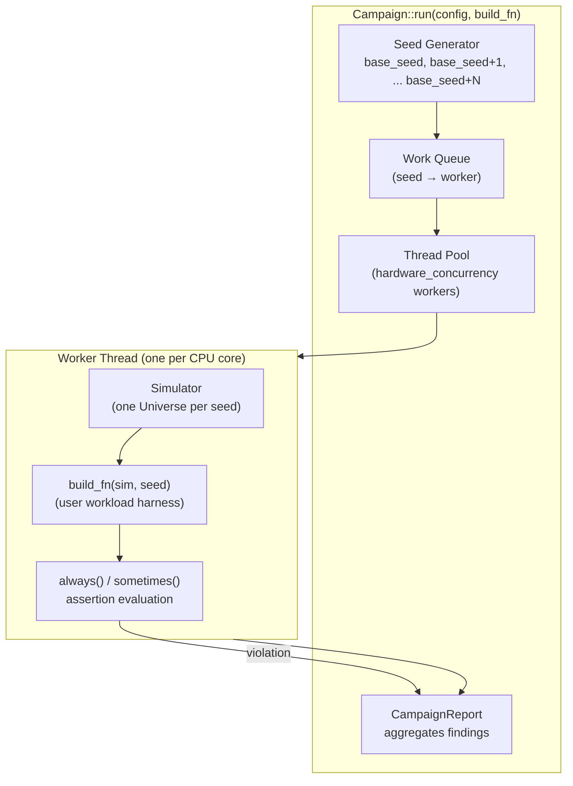
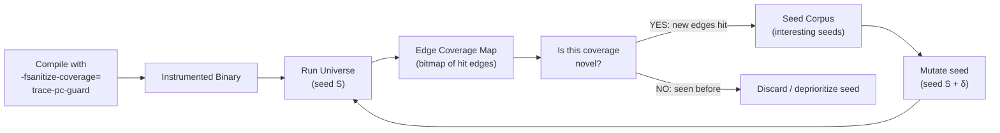
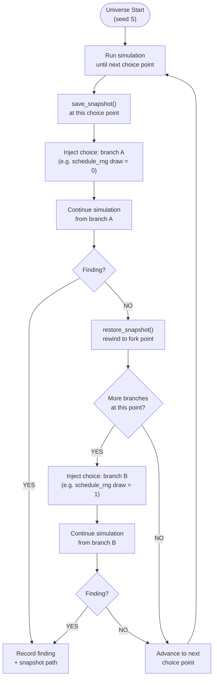
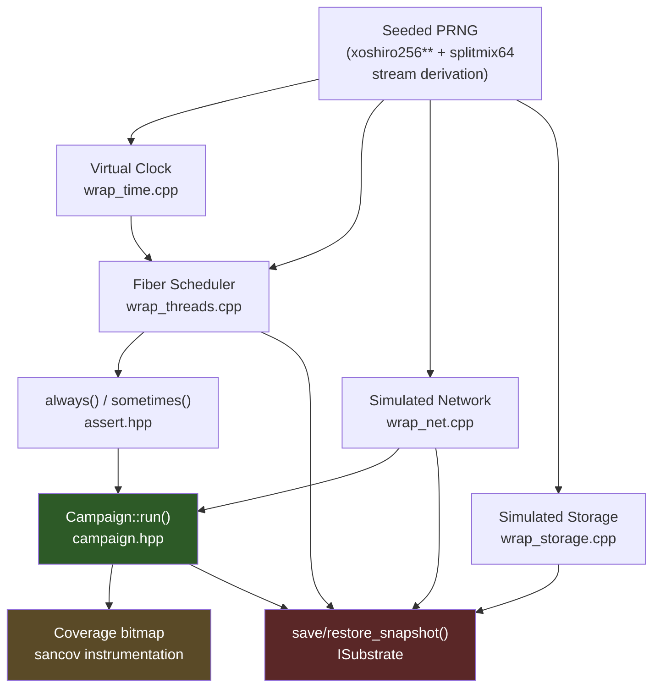
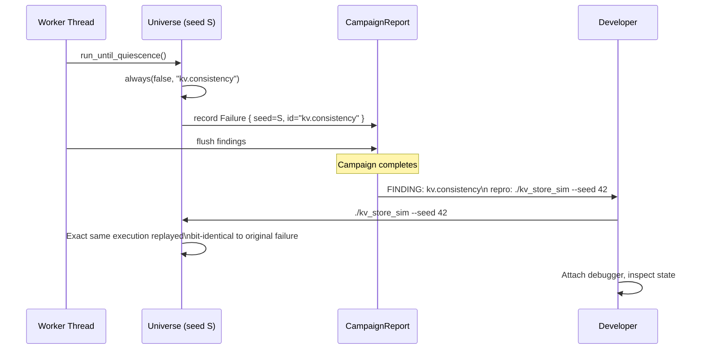
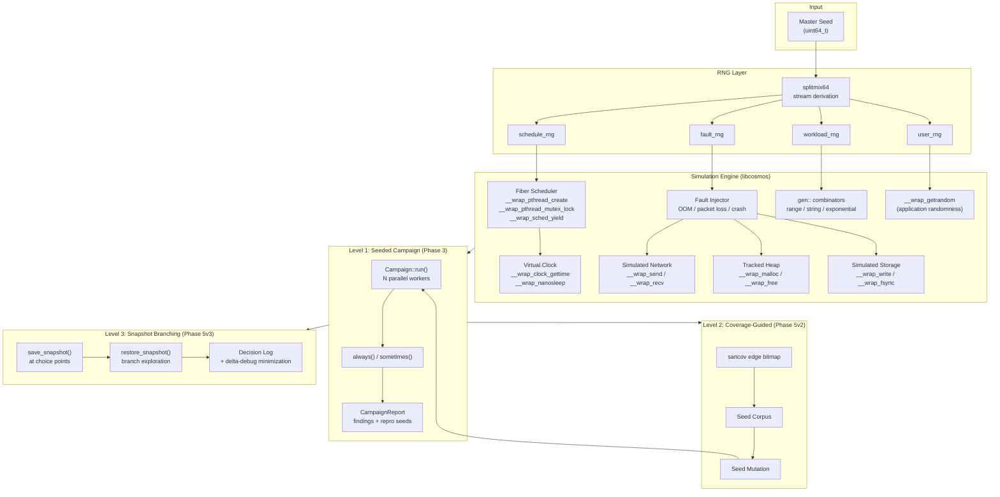

# State Exploration in Cosmos

This document defines the complete design for state exploration in `libcosmos` — how the simulation engine systematically discovers bugs that only manifest under specific combinations of thread interleavings, fault injections, and timing. It covers all three levels of exploration (seeded fuzzing, coverage guidance, and snapshot branching), the data structures and algorithms behind each, and the precise order in which they are built.

---

## Table of Contents

1. [The Problem: Why You Need Exploration](#1-the-problem-why-you-need-exploration)
2. [The State Space](#2-the-state-space)
3. [Choice Points: The Unit of Exploration](#3-choice-points-the-unit-of-exploration)
4. [Level 1 — Seeded Fuzzing Campaign (Phase 3)](#4-level-1--seeded-fuzzing-campaign-phase-3)
5. [Level 2 — Coverage-Guided Seed Selection (Phase 5v2)](#5-level-2--coverage-guided-seed-selection-phase-5v2)
6. [Level 3 — Snapshot Branching / Multiverse (Phase 5v3)](#6-level-3--snapshot-branching--multiverse-phase-5v3)
7. [Prerequisites and Dependency Order](#7-prerequisites-and-dependency-order)
8. [The Determinism Contract](#8-the-determinism-contract)
9. [Finding Lifecycle: From Detection to Reproduction](#9-finding-lifecycle-from-detection-to-reproduction)
10. [Full Architecture Diagram](#10-full-architecture-diagram)

---

## 1. The Problem: Why You Need Exploration

A standard test suite exercises one execution path through your system per test run. For a distributed storage engine or a consensus protocol, the real bugs live at the intersection of events that almost never co-occur in production:

- A leader election happens at the exact moment a `write()` call returns without an `fsync()`.
- Thread A holds a mutex while thread B times out waiting for a network response.
- Two packets arrive out of order, and the only code path that handles it correctly also has a memory leak.

These bugs have **extremely low probability per run** but near-certainty of existing somewhere in the state space. A single test run, no matter how carefully written, explores only one point in that space.

State exploration is the systematic answer: **run thousands of executions, each exploring a different region of the state space, with every failure reproducible by a single seed**.

---

## 2. The State Space

The total state space of a simulation universe is the Cartesian product of all non-deterministic decisions made during execution:

```
StateSpace = ThreadInterleavings × FaultSequences × WorkloadValues × TimeAdvancement
```

| Dimension | What Varies | Controlled By |
|---|---|---|
| **Thread Interleavings** | Which task runs at each scheduler choice point | `schedule_rng` |
| **Fault Sequences** | Which packets drop, which `malloc` calls fail, when nodes crash | `fault_rng` |
| **Workload Values** | Keys, values, message rates, request patterns | `workload_rng` |
| **User Randomness** | Any `getrandom()` calls made by application code | `user_rng` |

All five streams are derived from a **single 64-bit master seed** via splitmix64 stream derivation:

```
master_seed
    │
    ├─── splitmix64(domain=1) ──► schedule_rng   (thread scheduler choices)
    ├─── splitmix64(domain=2) ──► fault_rng      (fault injection decisions at runtime)
    ├─── splitmix64(domain=3) ──► workload_rng   (data/workload generation)
    ├─── splitmix64(domain=4) ──► user_rng       (application getrandom() calls)
    └─── splitmix64(domain=5) ──► swarm_rng      (per-universe fault config sampling)
```

This means **every execution is a pure function of its seed**. The same binary + the same seed = the same exact execution, down to individual bytes written to virtual storage.

### The Swarm Stream and Fault Configuration

The `FaultSequences` dimension has two levels of variation per universe, not one. The `swarm_rng` (domain=5) is drawn **once, before the run starts**, to configure the `FaultInjector` for that universe:

- **Which fault classes are active** — universe A might only inject memory faults; universe B only network faults
- **What rate each class fires at** — sampled log-uniformly, not hardcoded (e.g. `oom_rate` between `1e-5` and `1e-2`)
- **Which specific injection sites are activated** — the two-level BUGGIFY model from `docs/fault-injection.md §6`
- **What knob values are set** — extreme-but-legal tuning parameters (e.g. a 60s timeout becomes 0.1s)

The `fault_rng` (domain=2) is then drawn **per event at runtime** — every time `__wrap_malloc` or `__wrap_send` is called, the injector draws from its per-class sub-streams to decide whether to fire.

These two streams are kept separate because config sampling must not disturb runtime fault draws. See `docs/fault-injection.md §7` (RNG Stream Discipline) for the full rules.

The practical consequence for state exploration is that two universes with different seeds explore the state space in two independent ways: **different fault shapes** (swarm config) *and* **different fault timings** (runtime `fault_rng` draws). A campaign of 10,000 seeds gets 10,000 different storms, not the same light drizzle repeated 10,000 times.

---

## 3. Choice Points: The Unit of Exploration

A **choice point** is any moment during simulation where the outcome depends on a draw from a seeded RNG stream. These are the branch points of the state space tree.

### Scheduler Choice Points

Every time the fiber scheduler selects the next task to run from the `ReadyQueue`, it draws an index from `schedule_rng`:

```
ReadyQueue = [TaskA, TaskB, TaskC]
i = schedule_rng.range(0, 2)   // draws 0, 1, or 2 deterministically
resume(ReadyQueue[i])
```

Seed 1 might draw `[2, 0, 1, 2, 0]` — always running TaskC first. Seed 2 draws `[0, 2, 0, 1, 1]` — a completely different interleaving. Each seed explores a different valid concurrent execution of the same program.

### Fault Choice Points

Every fault decision is a draw from `fault_rng`:

```
// Should this packet be dropped?
bool dropped = fault_rng.coin(fault_profile.packet_loss);

// Should this malloc call fail?
bool oom     = fault_rng.coin(fault_profile.oom_rate);

// When does the next node crash?
Duration until_crash = fault_rng.exponential(fault_profile.crash_interval);
```

### The Choice Point Tree

Every execution traces a path through a tree of binary/N-ary decisions. Two seeds that make the same choices for the first 47 decisions but differ at decision 48 explore adjacent branches of this tree:

```
                    [Universe Start]
                          │
              ┌───────────┴───────────┐
          schedule[0]=A           schedule[0]=B
              │                       │
      ┌───────┴───────┐       ┌───────┴───────┐
  fault[0]=drop   fault[0]=ok  ...            ...
      │               │
   FINDING          pass
   (data loss)
```

State exploration is the process of walking as much of this tree as possible.

---

## 4. Level 1 — Seeded Fuzzing Campaign (Phase 3)

### What It Is

The simplest and most important form of exploration. Run N independent universes, each with a different seed, across all available CPU cores. Collect all assertion failures. Print a `--seed S` repro command for every failure found.

This is the **Phase 3 deliverable** and the foundation everything else builds on.

A naming note that applies throughout: **universe** is the concept — one simulated world per seed. The implementing class is `Simulator` (`include/cosmos/simulator.hpp`). Level 1 extends it with a seed constructor argument, `seed()`, and `record_finding(Failure)`.

### Architecture



### Data Structures

```cpp
// CampaignConfig: controls the run
struct CampaignConfig {
    uint64_t trials    = 1'000;
    uint64_t base_seed = 0;
    unsigned parallel  = std::thread::hardware_concurrency();
    bool     verify    = false;  // double-run trace hash verification
    // Reporting cap: per assertion_id, the printed report lists at most this
    // many distinct seeds. The full list always remains in findings.
    uint64_t max_seeds_per_finding = 10;
};

// A single finding: an always() violation, a crashing universe, or a
// determinism-contract violation caught by --verify.
struct Failure {
    uint64_t    seed;
    std::string assertion_id;   // "kv.read-your-writes", "crash",
                                // "determinism.violation", ...
    std::string detail;         // file:line from COSMOS_ALWAYS, or the
                                // diverging hash pair for verify failures
};

// Aggregated result of the full campaign
struct CampaignReport {
    uint64_t              runs;         // universes executed
    uint64_t              failed_runs;  // universes with >= 1 Failure or a crash
    std::vector<Failure>  findings;     // every violation, sorted by seed
    std::vector<std::string> never_hit; // sometimes() ids registered but never
                                        // satisfied, sorted by id
};

// failed_runs counts universes; findings counts violations — one run can
// produce several. And one bug hit by 4,000 of 10,000 seeds is still one
// bug: the printed report groups findings by assertion_id and lists at most
// CampaignConfig::max_seeds_per_finding distinct seeds per group.
```

### The Campaign Loop Algorithm

```
Build the seed list once: seeds = [base_seed, base_seed + trials). Push all
seeds into one shared work queue, then start a FIXED pool of
config.parallel workers. Never one thread per trial — a 10,000-trial
campaign must not create 10,000 threads.

worker loop (each of config.parallel workers):
    while queue not empty:
        seed = queue.pop()
        publish seed to this worker's current-seed slot   // crash attribution

        {   // RAII scope: installs sim as Simulator::current() on this
            // thread and restores the previous context on exit. The campaign
            // loop never calls set_current() by hand — the verify pass swaps
            // simulators, and manual context management leaks state.
            sim   = Simulator(seed)
            scope = Simulator::Scope(sim)

            build_fn(sim, seed)        // user workload + assertions
            sim.run_until_quiescence() // defined below

            if config.verify:
                sim2   = Simulator(seed)
                scope2 = Simulator::Scope(sim2)
                build_fn(sim2, seed)
                sim2.run_until_quiescence()

                if sim.trace_hash() != sim2.trace_hash():
                    // A determinism-contract violation is itself a finding.
                    // Record it and keep campaigning — never abort the pool.
                    record Failure{seed, "determinism.violation",
                                   "trace hash diverged on re-run"}
        }

        merge this worker's shard into the shared report     // one mutex
        flush the merged report to disk every N runs         // crash containment

shutdown pool
sort findings by seed, never_hit by id                      // stable output
print findings with "--seed S" repro commands
print registered-but-never-satisfied sometimes() ids
```

`trace_hash()` is an FNV-1a digest over the canonical little-endian encoding of the universe's event stream — the encoding is defined in `docs/fault-injection.md §11.3`. It is computed **incrementally as events occur**, never reconstructed after the fact: the original run and the verify re-run each hash their own live stream, and the two digests are compared at the end.

> **Encoding status:** fault-injection.md §11.3 does not yet define the scheduler/event encodings that the full stream will carry. Until the real event stream exists, implementations should feed `trace_hash()` from the `FaultLedger` (entries are already canonical) plus the virtual clock, structured so the full encoding can replace the interim input without changing the `trace_hash()` API or the campaign loop.

### Quiescence: When a Universe Ends

`run_until_quiescence()` returns when, and only when, all three conditions hold simultaneously:

1. The scheduler's `ReadyQueue` is empty — no task is runnable.
2. The virtual event queue is empty — no timer wakeups or I/O completions are pending at any future virtual time.
3. No packets are in flight — every sent packet has been delivered or dropped by the fault injector.

If any condition fails, the engine advances virtual time to the next queued event, delivers due packets, and continues. Note the dependency consequence: quiescence cannot be evaluated without the simulated network's in-flight packet queue, so `Campaign` depends on `Network`. The §7 graph reflects this — it is why Phase 2's network simulator is on the critical path for Phase 3, not just for Level 3 snapshots.

### Parallelism, Thread Safety, and Stable Output

The invariant that makes multi-threaded campaigning safe: **each universe is a pure function of its seed** (§2). OS scheduling, queue order, and core count cannot change any universe's outcome — only how universes are distributed across worker threads. Three consequences:

1. **Shared campaign state is mutated from `config.parallel` threads.** `Campaign::current()` — the `sometimes()` registry and hit set, plus the merged findings list — is campaign-wide. The default design is per-worker shards merged under a single mutex; a plain mutex on every `record_finding` / `register_sometimes` call is also acceptable, since these calls are rare relative to simulation work.
2. **`Simulator::current()` is thread-local** (`include/cosmos/simulator.hpp`), so each worker's universe is isolated by construction — but the campaign loop must install it through the RAII `Simulator::Scope` guard, never manual `set_current()`: the verify pass swaps `sim` → `sim2` on the same thread, and manual context management leaks state across universes.
3. **Reports must be made order-independent before printing.** Findings are sorted by seed and `never_hit` by id, so the same campaign produces byte-identical output regardless of worker interleaving.

### Crash Containment

The campaign exists to find memory-corruption bugs, and a real segfault inside one universe takes down its worker thread — and, unprepared, the whole campaign process along with every sibling worker's findings. Level 1 mandates the cheap mitigations; subprocess isolation is the robust follow-up:

1. **Per-worker current-seed marker.** Before running a seed, a worker publishes it to a per-worker slot. If the process dies, the marker identifies the crashing seed — that seed *is* the finding.
2. **Incremental flushing.** Findings and `sometimes()` registrations accumulate in per-worker shards, merge into the shared report under one mutex, and the merged report is dumped to disk periodically (e.g. every 100 runs). A crash then loses at most the current universe — never the campaign.
3. **Subprocess isolation (post-Phase 3).** Fork a child per seed (or per crashing seed) so the OS contains the blast radius. Deferred because items 1–2 already make crashes attributable and cheap to keep.

### How `always` and `sometimes` Work

Two API facts are pinned here. First, the context class is `Simulator` — this document says *universe* for the concept, and `Simulator` (`include/cosmos/simulator.hpp`) is the class; `Simulator::current()` is already thread-local in the code. Second, ids and details are `std::string_view` at the call site so the happy path allocates nothing; a `Failure` materializes `std::string`s only when a violation is actually recorded.

```cpp
namespace cosmos {

// Invariant: checked every time it is called within a universe.
// A single violation = one Failure recorded into the campaign report.
void always(bool cond, std::string_view id, std::string_view detail = {}) {
    if (!cond) {
        Simulator::current().record_finding({
            .seed         = Simulator::current().seed(),
            .assertion_id = std::string(id),
            .detail       = std::string(detail),
        });
    }
}

// Preferred call form: file:line is captured at compile time — zero runtime
// cost, no per-call formatting. This is what harness code should use.
#define COSMOS_STR2(x) #x
#define COSMOS_STR(x)  COSMOS_STR2(x)
#define COSMOS_ALWAYS(cond, id) \
    cosmos::always((cond), (id), __FILE__ ":" COSMOS_STR(__LINE__))

// Liveness: evaluated campaign-wide.
// Must be satisfied (cond == true) in at least ONE universe.
//
// The id is REGISTERED on every call and marked hit only when cond is true.
// Registration on every call is what makes never_hit work: if the assertion
// is never satisfied anywhere, the campaign still knows the id exists and
// reports it in CampaignReport::never_hit. A version that records only on
// success can never discover an unsatisfied id — never_hit would always be
// empty.
//
// Campaign::current() is campaign-wide state shared by all worker threads;
// its synchronization is specified in "Parallelism, Thread Safety, and
// Stable Output" above.
void sometimes(bool cond, std::string_view id) {
    Campaign::current().register_sometimes(id);  // every call
    if (cond) {
        Campaign::current().mark_hit(id);        // satisfied in this universe
    }
}

}
```

A design contrast worth pinning so nobody "simplifies" the two calls into one another later: `always()` records **only on violation** (a satisfied invariant produces no data), while `sometimes()` registers **on every call** and marks hit only on success. The asymmetry is forced by their different failure modes — a satisfied `always()` is uninteresting, but a `sometimes()` that is never satisfied anywhere is a *silently unexercised path*, and registration-on-every-call is the only way `never_hit` can know the id existed.

### Single-Seed Repro Mode

Every finding prints `--seed S`. That promise is only real if the harness has a code path that runs exactly one seed, so `campaign.hpp` ships it:

```cpp
// Run exactly one universe with the given seed, using the same build_fn the
// campaign used. Prints any findings to stderr. Returns 0 on a clean run,
// 1 if the universe produced a finding — so CI can pin a regression to a
// single seed.
int run_single(uint64_t seed, BuildFn build_fn);
```

The harness contract:

1. Parse `--seed S` before anything else; if present, `return run_single(S, build_fn);` — do not start a campaign.
2. Pass the *identical* build_fn to `Campaign::run` and `run_single`. Factor it into a named function rather than an inline lambda, or repro runs will silently diverge from campaign runs.
3. The repro execution must be bit-identical to the failing campaign execution (same binary, same seed — §8). Any difference is itself a determinism bug.

### User-Facing API (what a harness looks like)

```cpp
#include <cosmos/campaign.hpp>
#include <string>
#include <string_view>

// The workload is a named function, not an inline lambda, so campaign mode
// and --seed repro mode run the *identical* build_fn (see Single-Seed
// Repro Mode above).
void build_universe(cosmos::Simulator& sim, uint64_t seed) {
    // Build your system inside the universe
    auto* kv = new KVStore();

    // Faults — two options, pick one per harness:
    //   - Pin an explicit profile (below): overrides the swarm-sampled
    //     config for every universe. Useful for targeted campaigns.
    //   - Leave faults unset: swarm_rng (domain 5, §2) samples the config
    //     per universe instead. The full FaultConfig/FaultInjector API that
    //     supersedes FaultProfile is specified in fault-injection.md §12.
    cosmos::FaultProfile fp;
    fp.oom_rate    = 0.001;
    fp.packet_loss = 0.05;
    sim.set_faults(fp);

    // Run workload
    for (int i = 0; i < 1000; ++i) {
        std::string key = cosmos::gen::string(sim.workload_rng(), 8);
        kv->put(key, "value");

        // Assert invariant: every put must be readable.
        // COSMOS_ALWAYS captures file:line automatically.
        COSMOS_ALWAYS(kv->get(key) == "value", "kv.read-your-writes");
    }

    // Liveness: crash recovery must be exercised at least once across the
    // campaign. NOTE: crash_count() requires the Process fault class
    // (fault-injection.md §12) and the simulated storage model — see the
    // Phase 3 exit criteria below.
    cosmos::sometimes(sim.crash_count() > 0, "kv.crash-exercised");
}

int main(int argc, char** argv) {
    // Repro mode first: `--seed S` runs exactly one universe and exits.
    // This is the command every finding prints.
    if (argc == 3 && std::string_view(argv[1]) == "--seed") {
        return cosmos::run_single(std::stoull(argv[2]), build_universe);
    }

    cosmos::CampaignConfig cfg;
    cfg.trials  = 10'000;
    cfg.verify  = true;   // every seed runs twice to confirm determinism

    auto report = cosmos::Campaign::run(cfg, build_universe);

    if (!report.findings.empty()) {
        for (auto& f : report.findings) {
            std::println("FINDING: {} (repro: --seed {})", f.assertion_id, f.seed);
        }
        return 1;
    }
    for (auto& id : report.never_hit) {
        std::println("NEVER HIT: {}", id);
    }
    return 0;
}
```

### Exit Criteria for Phase 3

- 10,000-seed campaign runs across all cores; the campaign process itself survives a crashing universe (Crash Containment, above).

> **Dependency note:** the last exit criterion (KV lost-write under crash faults) is transitively blocked on the Phase 2 storage simulator *and* the Process fault class — the campaign API itself is not, which is why Phase 3 ships first. Until storage lands, a placeholder demo (OOM + virtual-timing faults) or no demo at all is acceptable; only the final criterion waits.
- Every failure prints a `--seed S` repro command, and `--seed S` replays it via `run_single` — bit-identical to the campaign execution.
- `--verify` mode confirms `trace_hash(seed) == trace_hash(seed)` for all seeds; a mismatch is recorded as a `determinism.violation` finding, not an abort.
- The single-node KV store example detects a known lost-write bug under crash faults. (This transitively requires the Phase 2 storage simulator and the Process fault class from `docs/fault-injection.md` — the Phase 1 scheduler/PRNG stages alone are not enough.)

---

## 5. Level 2 — Coverage-Guided Seed Selection (Phase 5v2)

### What It Is

Seeded fuzzing (Level 1) explores the state space blindly — each seed is as likely to hit new code as any other. Coverage-guided exploration **prefers seeds that exercise novel execution paths**, using compiler-inserted instrumentation to measure which code edges each execution reaches.

This is the same principle that made AFL and libFuzzer so effective for input fuzzing, applied to the distributed execution trace.

### How It Works



### Coverage Bitmap

The compiler inserts a callback at every basic block edge:

```c
// Inserted by -fsanitize-coverage=trace-pc-guard at each edge:
void __sanitizer_cov_trace_pc_guard(uint32_t* guard) {
    // Record that this edge was hit in the current universe's coverage bitmap
    coverage_bitmap[*guard / 8] |= (1 << (*guard % 8));
}
```

At the end of each universe, Cosmos computes:

```
novelty = coverage_bitmap(seed) AND NOT union_of_all_previous_bitmaps
```

If `novelty != 0`, this seed reached previously unseen code — it gets added to the corpus for mutation.

### Seed Mutation Strategy

Corpus seeds are mutated to produce new candidates:

```
new_seed = corpus_seed XOR splitmix64(mutation_counter)
```

This ensures mutations explore seeds near interesting ones in the decision space, not random jumps.

### What This Catches That Level 1 Misses

Level 1 might run 10,000 seeds and never exercise the error-handling branch inside `recv()` after a partial write. Coverage-guidance notices that no seed has hit that branch and **actively steers** new seeds toward it via mutation.

---

## 6. Level 3 — Snapshot Branching / Multiverse (Phase 5v3)

### What It Is

The most powerful exploration mode. Instead of running every universe from scratch, the engine **forks** an execution at a choice point, explores one branch, then **rewinds** to the fork point and explores another branch — without replaying from the beginning.

This is what Antithesis does at the hypervisor level (full VM memory snapshots). Cosmos does it in-process via explicit heap + RNG + event queue serialization.

### The Core Insight

```
Time 0 ──────────────── T=100ms ─────────────────────────────────
                             │
                    [Choice Point: scheduler picks TaskA or TaskB]
                             │
              ┌──────────────┴──────────────┐
          Branch A                       Branch B
        (TaskA first)                 (TaskB first)
              │                             │
         T=110ms                        T=115ms
          FINDING                          pass
       (deadlock)
```

Without snapshots: to explore Branch B after finding Branch A's deadlock, you'd restart from time 0 and replay the first 100ms.

With snapshots: you rewind to T=100ms instantly and inject a different `schedule_rng` draw.

### Snapshot Data Structure

A snapshot captures the complete, restorable state of one simulation universe at one moment in virtual time:

```cpp
struct Snapshot {
    // 1. Virtual time
    uint64_t virtual_time_ns;

    // 2. Top-level RNG state for schedule, workload, and user streams
    struct RngState {
        uint64_t s[4];   // xoshiro256** state
    };
    RngState schedule_rng;
    RngState workload_rng;
    RngState user_rng;
    // Note: swarm_rng is NOT snapshotted — it is drawn once before the run
    // and its result is baked into fault_injector_state.config below. It does
    // not advance during execution and does not need to be restored.

    // 3. FaultInjector internal state
    // Restoring only the top-level fault_rng is not sufficient. The injector
    // holds five independent per-class sub-streams (Memory, Network, Storage,
    // Clock, Process), each at a different position. Budget counters, active
    // episodes, and quiet depth must also be captured.
    // See docs/fault-injection.md §7 (Rule 2) for why sub-stream isolation
    // makes this a correctness requirement, not just a convenience.
    struct FaultInjectorState {
        // Per-class RNG sub-streams (all five must be snapshotted)
        RngState memory_sub_stream;
        RngState network_sub_stream;
        RngState storage_sub_stream;
        RngState clock_sub_stream;
        RngState process_sub_stream;

        // Budget counters (from FaultConfig::oom_skip_first / oom_max_count)
        uint64_t allocs_seen;
        uint64_t oom_injected;

        // Active episode registry: which partitions / crashes are currently
        // live and what their scheduled heal virtual timestamps are.
        std::vector<ActiveEpisodeRecord> active_episodes;

        // Quiet window nesting depth (push_quiet / pop_quiet balance)
        int quiet_depth;

        // FaultLedger up to the snapshot point.
        // Needed so minimization replay can continue appending entries
        // after a restore without losing the decision trace from before
        // the fork point.
        FaultLedger ledger_snapshot;

        // The FaultConfig sampled for this universe (knob values, rates,
        // active classes). Does not change during the run but is included
        // so a restored branch inherits the same configuration.
        FaultConfig config;
    };
    FaultInjectorState fault_injector_state;

    // 4. Heap state: full copy of every live allocation
    // (possible because TrackedHeap::active_map_ tracks every allocation)
    std::vector<uint8_t> heap_image;
    std::vector<HeapAllocationRecord> allocation_table;

    // 5. In-flight network packets (not yet delivered)
    std::vector<Packet> inflight_packets;

    // 6. Virtual event queue (pending timer wakeups, I/O completions)
    std::vector<Event> event_queue;

    // 7. Fiber scheduler state (all task stacks + program counters)
    std::vector<FiberSnapshot> task_states;

    // 8. Virtual storage state (page cache + durable image)
    std::vector<PageCacheEntry> page_cache;
    std::vector<uint8_t>        durable_storage;
};
```

### Snapshot Allocation Discipline

The `std::vector` fields above illustrate the shape, not the storage strategy. In production, snapshots must be captured from **pre-allocated arena storage, not `std::vector`**. Two reasons:

1. Fault decisions execute inside `__wrap_malloc` — that is precisely why `FaultLedger` is fixed-size and allocation-free. A snapshot capture that allocates from the wrapped heap risks reentrancy and infinite regress.
2. Capturing at a choice point must be O(capture) with no hidden allocator failure modes; an OOM injected at exactly the wrong moment must not corrupt the exploration tree.

The rule that resolves both: **branch only at scheduler choice points** (which never occur inside a `__wrap_*` call), and back snapshot storage with a fixed arena sized from `CampaignConfig` budgets. The `std::vector` forms above are acceptable for the `fork()`-COW variant, which never serializes in-process.

### Heap Capture Cost

A naive L3 that deep-copies `heap_image` at *every* choice point copies the whole live heap hundreds of times per universe — the dominant cost of the whole exploration. Mitigation strategies, in the order they should be adopted:

1. **Lazy capture** — snapshot at a choice point only when the explorer actually backtracks past it. The first pass through each point is free; typical explorations backtrack only at a small fraction of points.
2. **Dirty tracking** — a per-allocation generation counter on `TrackedHeap` (which already tracks every allocation in `active_map_`, `include/cosmos/memory.hpp`), so restore-to-checkpoint copies only allocations modified since the previous capture rather than the full image.
3. **`fork()` COW** — graduate to this earlier than "eventually" if universe heaps are large (see the strategy table below); the kernel does the copy-on-write work and the in-process heap image disappears entirely.

The exploration loop should be budgeted in `CampaignConfig` (max snapshots, max retained per depth) so worst-case memory is bounded regardless of strategy chosen.
```


### Save and Restore

```cpp
class SimSubstrate : public ISubstrate {
public:
    Snapshot save_snapshot() override {
        Snapshot snap;
        snap.virtual_time_ns    = clock_.now_ns();
        snap.schedule_rng       = scheduler_.rng().state();
        snap.fault_rng          = faults_.rng().state();
        snap.workload_rng       = workload_.rng().state();
        snap.heap_image         = heap_.serialize();       // deep copy
        snap.inflight_packets   = network_.drain_inflight();
        snap.event_queue        = event_queue_.snapshot();
        snap.task_states        = scheduler_.snapshot_all_fibers();
        snap.durable_storage    = storage_.durable_image();
        return snap;
    }

    void restore_snapshot(Snapshot&& snap) override {
        clock_.set(snap.virtual_time_ns);
        scheduler_.rng().restore(snap.schedule_rng);
        fault_.rng().restore(snap.fault_rng);
        workload_.rng().restore(snap.workload_rng);
        heap_.restore(snap.heap_image, snap.allocation_table);
        network_.restore(snap.inflight_packets);
        event_queue_.restore(snap.event_queue);
        scheduler_.restore_all_fibers(snap.task_states);
        storage_.restore(snap.durable_storage);
    }
};
```

### The Branching Exploration Loop



### Decision Log and Minimization

Every branch taken — both scheduler choices and fault decisions — is recorded in the **FaultLedger** (defined fully in `docs/fault-injection.md §11`). The ledger is the authoritative replay input for minimization.

Each entry captures:

```cpp
// From fault-injection.md §11.1
struct LedgerEntry {
    uint64_t  virtual_time_ns;  // virtual timestamp of this decision
    FaultClass cls;             // SCHEDULER | MEMORY | NETWORK | STORAGE | ...
    SiteId    site;             // stable ID of the injection site
    Status    status;           // Fired | Skipped | Suppressed
    bool      drew;             // whether an RNG draw was consumed
};
```

The `drew` flag is essential. A `Skipped` entry that returned early before the RNG and a `Skipped` entry that drew and lost the coin flip look identical in terms of outcome but leave the RNG sub-stream in different states. Without this flag, a replay cannot realign the sub-stream correctly after a suppression.

**Why fault identity uses `site_id`, not an occurrence counter:**

Minimization works by suppressing entries one-at-a-time and re-running to check if the failure still occurs. If fault identity were `(class, occurrence_index)` — e.g. "the 7th memory fault" — then suppressing fault #3 changes the application's control flow: it retries differently, allocates a different number of times, and what was the 7th allocation is now the 6th. The index scheme collapses.

Instead, identity comes from the **recorded decision trace**: a replay reads the ledger rather than recomputing indices. At each decision point, it consumes the next ledger entry for that site and honours it — including consuming the same RNG draw when `drew = yes`, so the per-class sub-stream stays aligned. Suppression rewrites one entry's outcome to `Suppressed` and leaves every other entry untouched. This is why the `Snapshot` above captures `ledger_snapshot` — after a restore, the replay must continue appending to the pre-fork portion of the ledger, not start fresh.

**What minimization produces:**

One-at-a-time reduction yields a **1-minimal** set: no single remaining entry can be removed without losing the failure. This is not necessarily the globally smallest set (`ddmin` would find that at higher cost). The report states which guarantee it offers.

The minimal failing trace — the shortest sequence of scheduler choices and fault injections that triggers the bug — is printed alongside the `--seed S` repro command.

### The Fiber Snapshot Problem

Snapshotting fiber task stacks is the hardest part of Level 3. Each fiber has:
- A stack (user-space memory, typically 64KB–1MB)
- A saved register set (`rsp`, `rbp`, `rip`, callee-saved registers)
- Its position in a `__wrap_*` call (e.g., suspended inside `__wrap_recv`)

The snapshot must capture all of this and restore it exactly. Two implementation strategies:

| Strategy | How | Trade-off |
|---|---|---|
| **Stack copy** | `memcpy` the full fiber stack into `FiberSnapshot::stack_bytes` | Simple; works for any fiber library |
| **`fork()` COW** | `fork()` the process at the snapshot point; child explores branch A, parent explores branch B via COW pages | Zero copy cost; requires careful fd/signal cleanup |

Phase 5v3 starts with stack copy (simpler, fully in-process) and may graduate to `fork()` COW for larger heaps.

> **Scheduler design constraint:** "works for any fiber library" is true only of the *mechanism*, not the *scheduler*. Stack-copy snapshots require the Phase 1 fiber scheduler to be designed snapshot-first: each fiber on an isolated, contiguous stack, saved context as plain data (ucontext/assembly swapcontext, not a library with hidden per-fiber state), and no fiber-local TLS or side tables that a restore would miss. This must be pinned as a Phase 1 scheduler requirement, or Level 3 will have to rewrite the scheduler.

---

## 7. Prerequisites and Dependency Order

Each level of state exploration has hard dependencies on earlier subsystems:



| Component | Needed By | Phase |
|---|---|---|
| Seeded PRNG (`xoshiro256**`) | Everything | Phase 1 |
| Virtual Clock | Fiber Scheduler | Phase 1 |
| Fiber Scheduler | All exploration levels | Phase 1 |
| Simulated Network | Campaign (quiescence), Snapshot (inflight packets) | Phase 2 |
| `always()` / `sometimes()` | Campaign runner | Phase 3 |
| `Campaign::run()` | All exploration | Phase 3 |
| Sancov instrumentation | Coverage-guided | Phase 5v2 |
| `save/restore_snapshot()` | Snapshot branching | Phase 5v3 |

---

## 8. The Determinism Contract

State exploration is only meaningful if the same seed always produces the same execution. The following rules must hold or exploration becomes worthless:

| Rule | Why It Matters |
|---|---|
| All time via `clock_gettime` or `sim.now()` | If code reads the hardware TSC directly (`RDTSC`), virtual time cannot control it |
| All randomness via `getrandom` or `sim.rng()` | A direct read of `/dev/urandom` bypasses `__wrap_getrandom` and injects real entropy |
| No iteration over raw pointer containers | `std::unordered_map<T*>` iteration order depends on ASLR; two runs of the same seed may visit keys in different orders |
| No `-ffast-math` in behavior-critical paths | IEEE754 non-determinism (NaN propagation, rounding) can produce different results across compilers and CPUs |
| All concurrency via POSIX `pthread_*` | Raw `clone(2)` syscalls bypass `__wrap_pthread_create` and create real OS threads not controlled by the scheduler |

When `CampaignConfig::verify = true`, the campaign runner catches violations automatically by re-running every seed and comparing the `FNV-1a` event trace hash. A mismatch means something in the application is reading non-deterministic state.

---

## 9. Finding Lifecycle: From Detection to Reproduction



Every failure is fully reproducible because:

1. The binary is deterministic (same seed = same execution).
2. The seed is printed with the failure.
3. The developer runs `./myapp_test --seed S` to replay the exact failure path (backed by `cosmos::run_single`, §4).

---

## 10. Full Architecture Diagram



---
